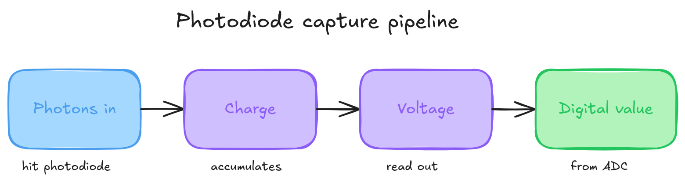
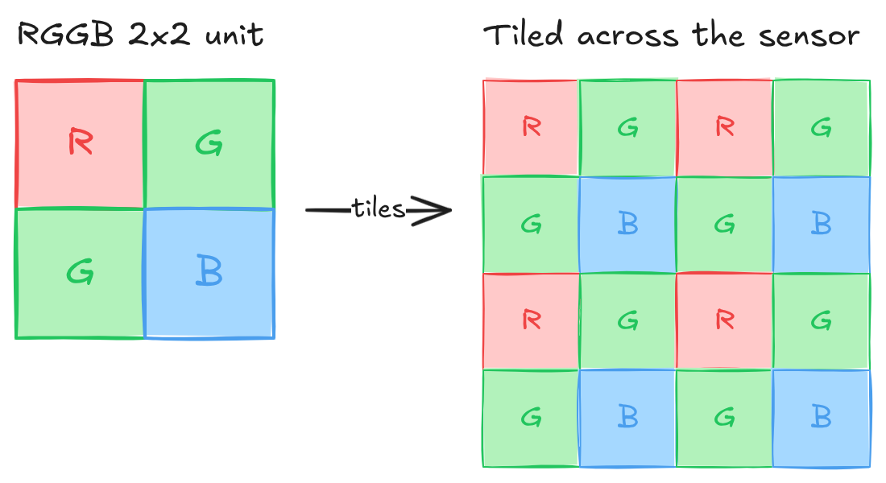
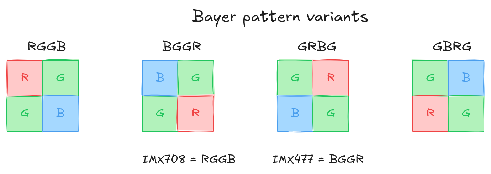
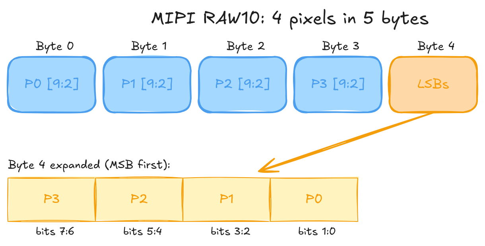
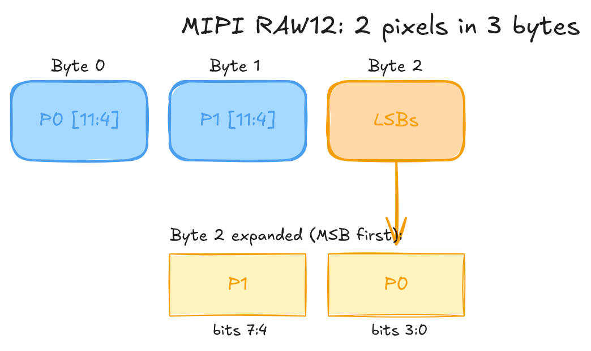
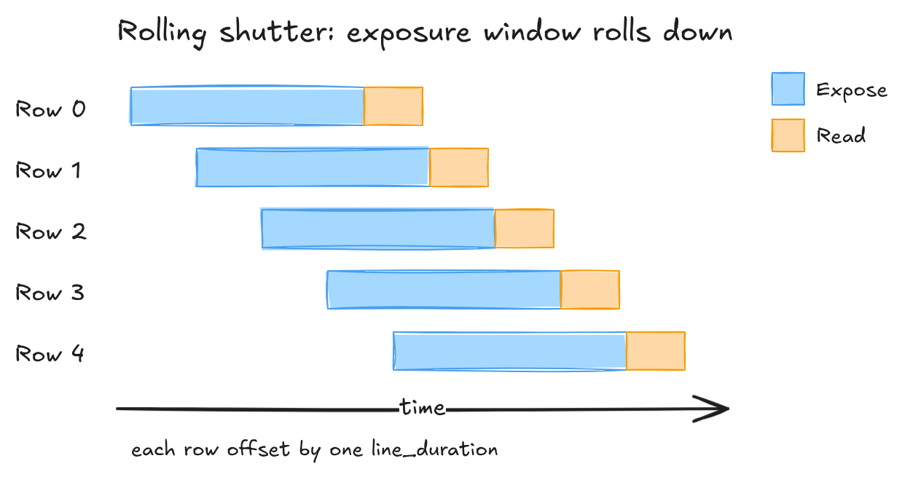
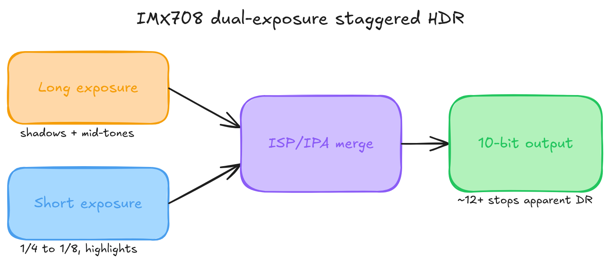

# A1 — Camera Sensor Fundamentals

Photodiodes, Bayer colour filter arrays, bit depth, packed raw formats, rolling shutter, sensor modes, and HDR. Referenced from Part 1/04 (pixel formats in code).

> **Platform note:** All bit-level layouts here assume **little-endian** byte order. Raspberry Pi 5 (BCM2712, Cortex-A76) is little-endian. Adjust if you port to a big-endian system.

---

## How Camera Sensors Work

Pull a raw frame straight off `/dev/video0` on the Pi 5 and you don't get a picture. You get a block of 10-bit packed bytes that decodes to a green-tinted grid of garbage. Everything in this appendix lives between that block and an actual image: how the sensor turns photons into numbers, why those numbers skew green, and how they get crammed into memory.

A sensor is a grid of millions of photodiodes, and each one does the same dumb job. Collect photons during exposure. Let them knock loose some charge. Read the charge out as a voltage. Hand the voltage to an ADC. Four steps, a few million times a frame.



The catch: a photodiode can't see colour. It counts photons, full stop. Red light and blue light of the same intensity hand back the same number. That's the problem the Bayer filter exists to solve.

---

## The Bayer Color Filter Array

Kodak's fix, from Bryce Bayer in 1976, is almost insultingly simple. Glue a tiny coloured filter over each photodiode so it only sees one colour. Arrange those filters in a repeating pattern, and you can reconstruct full colour later from the neighbours. That array of filters is the colour filter array, or CFA.

The usual pattern is a 2x2 tile: one red, one blue, and two green on the diagonal. That tile repeats across the whole sensor.



Why two greens? Your eyes care about green more than red or blue. Most of what you perceive as sharpness and brightness rides on the green channel, so doubling it buys more luminance detail where it matters and leaves the colour reconstruction cleaner.

### Bayer Pattern Variants

Not every sensor starts the tile in the same corner. Same four filters, different starting phase, and the debayering code has to know which is which. Get it wrong and red and blue swap, so faces go blue and skies go orange.



### Pattern Phase and Crop Alignment

Here's a trap that costs people an afternoon. Crop a raw Bayer frame at an odd pixel coordinate and the pattern shifts under you. An RGGB frame cropped at (0, 0) is still RGGB. Crop the same frame at (1, 0) and it reads as GRBG. The mapping for an RGGB base:

| Crop origin (x, y) | Effective pattern |
|--------------------|-------------------|
| (even, even)       | RGGB              |
| (odd, even)        | GRBG              |
| (even, odd)        | GBRG              |
| (odd, odd)         | BGGR              |

So any ROI or pipeline stage that crops raw data has to snap its crop origin to even coordinates on both axes, or you change the pattern without meaning to. If the sensor driver does a hardware crop, check `VIDIOC_SELECTION` or the pad format rectangle. The driver might shift the rectangle to keep Bayer alignment, or it might not, in which case the reported origin tells you the phase offset you're stuck with.

The parity rule is general. For any base pattern, the effective CFA shifts one position inside the 2x2 tile for each odd step in x or y. The table uses RGGB because that's the IMX708 case. Start from your sensor's real base (BGGR for the IMX477) and apply the same modular shift.

---

## Bit Depth: 10-bit vs 12-bit

People argue 10-bit versus 12-bit like it's a quality tier you buy up into. It mostly isn't. Bit depth is how finely you slice the range, not how wide the range is.

**Bit depth** sets how many brightness levels each pixel can distinguish:

| Bit Depth | Brightness Levels | Max linearly-representable DR |
|-----------|-------------------|-------------------------------|
| 8-bit     | 256               | 256:1 (~8 stops)              |
| 10-bit    | 1,024             | 1,024:1 (~10 stops)           |
| 12-bit    | 4,096             | 4,096:1 (~12 stops)           |
| 14-bit    | 16,384            | 16,384:1 (~14 stops)          |

**Dynamic range** is a physics property of the sensor: full-well charge capacity over the read noise floor, the brightest signal it can hold against the faintest it can still tell apart. Bit depth doesn't set that. It sets the precision you quantise it with.

The rule that matters: bit depth has to cover at least as many stops as the sensor's native DR. A 10-stop sensor needs 10 bits to keep every distinguishable tone; go lower and you get banding. Go higher and you're spending bits on noise. When the depth exactly matches the native DR, every stop gets an equal slice of the budget:

| Bit depth | 2^N / N stops | Levels per stop | Banding |
|-----------|---------------|-----------------|---------|
| 8-bit     | 256 / 8       | 32              | visible in smooth sky gradients |
| 10-bit    | 1024 / 10     | 102             | imperceptible |
| 12-bit    | 4096 / 12     | 341             | very smooth |

These hold for any sensor whose native DR equals what the depth can encode. Capture an 8-stop sensor at 10-bit and the extra bits just sit there carrying nothing, banding gets even less likely. Run a sensor whose DR exceeds the depth and the banding shows up first in the shadows, where the steps are widest.

The two Pi sensors: the IMX708 is about 10 stops native, the IMX477 about 12. So 10-bit already captures everything the IMX708 resolves in standard mode. Its HDR mode reaches further, but it does that by merging two exposures and tone-mapping back down to 10-bit, not by adding bits. Grabbing IMX708 standard output at 12 bits buys you bandwidth cost and zero information.

### Quality Differences

| Aspect | 10-bit (IMX708) | 12-bit (IMX477) |
|--------|-----------------|-----------------|
| Tonal Gradations | 1,024 levels | 4,096 levels |
| Banding Risk | Low | Very low |
| Shadow Recovery | Good | Excellent |
| Highlight Recovery | Good | Excellent |
| File Size | Smaller | ~20% larger |
| Processing Speed | Faster | Slightly slower |
| Best For | Video, general use | Photography, HDR |

### Raspberry Pi Camera Sensors

|             | Camera Module 3 (IMX708) | HQ Camera (IMX477) |
|-------------|--------------------------|--------------------|
| Resolution  | 4608 x 2592 (11.9 MP)    | 4056 x 3040 (12.3 MP) |
| Bit depth   | 10-bit                   | 12-bit             |
| Raw format  | `SRGGB10P` (packed 10-bit RGGB) | `SBGGR12P` (packed 12-bit BGGR) |
| Pixel size  | 1.4 µm                   | 1.55 µm            |

---

## Packed and Unpacked Raw Formats

This is where the afternoon actually goes. The bytes off the device aren't one neat value per pixel. Pi sensors hand you the MIPI CSI-2 packed layout, RAW10 or RAW12, straight from `/dev/video0` on rp1-cfe, and if you read it like a normal array you get noise.

### 10-bit Packed (MIPI RAW10): 4 pixels in 5 bytes

Four bytes carry the top eight bits of four pixels. The fifth byte mops up the two low bits of each, most significant pixel first.



```c
// Unpack pixel N (N = 0..3) from a 5-byte RAW10 group
uint16_t msbs = static_cast<uint16_t>(byte[N]) << 2;
uint16_t lsbs = (byte[4] >> (N * 2)) & 0x03u;
uint16_t pixelN = msbs | lsbs;   // 10-bit value, range 0..1023
```

### 12-bit Packed (MIPI RAW12): 2 pixels in 3 bytes

Two bytes carry the top eight bits of two pixels. The third byte holds both low nibbles: pixel 1 high, pixel 0 low.



```c
// Unpack pixel 0 from a 3-byte RAW12 group
uint16_t msbs = static_cast<uint16_t>(byte[0]) << 4;
uint16_t lsbs = byte[2] & 0x0Fu;
uint16_t pixel0 = msbs | lsbs;   // 12-bit value, range 0..4095
// pixel1: msbs = byte[1] << 4; lsbs = (byte[2] >> 4) & 0x0F;
```

The byte holding the low bits (byte 4 for RAW10, byte 2 for RAW12) puts pixel 0 at the bottom: bits [1:0] for RAW10, bits [3:0] for RAW12. Get the order backwards and every value is subtly wrong in a way that looks like noise, not a crash, which is why it eats time.

There are **unpacked variants** too. Drop the `P` from the FourCC (`SRGGB10` instead of `SRGGB10P`) and each sample sits right-aligned in a 16-bit little-endian word, upper bits zeroed. Trivial to read, but you pay 60% more bandwidth at 10-bit and 33% at 12-bit. The FourCC encodes both axes at once: `SRGGB10P` is packed 10-bit RGGB, `SBGGR12P` is packed 12-bit BGGR.

---

## Rolling Shutter vs Global Shutter

Every CMOS sensor on a Pi cheats. It doesn't expose the whole frame at once. It scans row by row from the top, and by the time the bottom row starts collecting light, the top row is already read out and reset. The exposure window rolls down the sensor.



A **global shutter** exposes every row at the same instant and reads them out after. No rolling artefacts, but it needs storage at every pixel, which eats silicon and costs you sensitivity. Both the IMX708 and the IMX477 are rolling-shutter parts, so you live with the artefacts.

You can estimate readout time per mode from controls the driver exposes (see A5 §2.1):

```
readout_time = active_height × (active_width + hblank) / pixel_rate
```

Read `V4L2_CID_PIXEL_RATE` and `V4L2_CID_HBLANK` at runtime. Don't hard-code them, they change with the mode.

### What the Roll Actually Does

Skew is the one you'll notice first. The top rows catch a moving subject earlier than the bottom rows, so anything fast leans. At 2304x1296 the IMX708 reads out in roughly 17.9 ms. A lazy 30 deg/s pan tilts the subject about half a degree, invisible. A hard sports whip-pan at 180 deg/s tilts it past three degrees, and now the whole subject leans on screen.

```
skew_angle_degrees ≈ angular_velocity_deg_per_s × readout_time_s
```

Slow the mode down and it gets worse fast. Full-resolution at 14fps reads out near 66 ms, so the same pan leans about 3.5 times harder. Then there's wobble, where sinusoidal handshake offsets each row's horizontal position and straight lines go wavy. And flash sync: a flash shorter than the readout lights only a band of rows, which caps sync speed at roughly one over the readout time. Shorter readout, smaller everything. Higher frame-rate modes are the cure.

---

## Sensor Modes and Binning

Pi sensors don't give you a free-form crop knob. They expose a handful of fixed modes, each one a specific readout config that trades field of view, resolution, frame rate, and noise. Picking a mode is picking a point in that trade, whether you realise it or not.

The mechanism behind the sub-resolution modes matters. **Binning** sums adjacent photosites before the ADC. In 2x2 binning, four sites become one output pixel: resolution halves on each axis, the full field of view stays, and sensitivity climbs about 4x, which buys roughly +6 dB SNR while amortising read noise. **Line skipping** just throws away alternating rows. Same resolution drop, same frame-rate win, none of the sensitivity gain, plus aliasing on fine detail because the skipped rows contributed nothing. The IMX708 and IMX477 bin rather than skip, so that SNR improvement is real and not a spec-sheet fairy tale.

### IMX708 Modes (Camera Module 3)

| Mode | Output size | FPS | Method | Est. readout time | FOV | SNR delta | libcamera selects at |
|------|-------------|-----|--------|-------------------|-----|-----------|----------------------|
| Full | 4608 × 2592 | 14 | No binning | ~66 ms | Full | Baseline | 4608×2592 |
| 2×2 binned | 2304 × 1296 | 56 | 2×2 binning | ~17.9 ms | Full | +6 dB | 1920×1080, 1280×720 |
| 2×2 binned crop | 1536 × 864 | 120 | 2×2 binning + centre crop | ~8.3 ms | ~50% area | +6 dB | 640×480 and below |

Treat the readout times as estimates. For exact per-mode numbers, read `V4L2_CID_PIXEL_RATE` and `V4L2_CID_HBLANK` at runtime (see A5 §2.1).

For video, 2304x1296 is the one to reach for: full field of view, far better low-light than full-res, and it fits the 2-lane CSI-2 budget at 56fps.

### IMX477 Modes (HQ Camera)

| Mode | Output size | FPS | Method | Est. readout time | FOV | SNR delta | Notes |
|------|-------------|-----|--------|-------------------|-----|-----------|-------|
| Full | 4056 × 3040 | 10 | No binning | ~90 ms | Full | Baseline | Highest DR (12-bit) |
| 2×2 binned | 2028 × 1520 | 40 | 2×2 binning | ~25 ms | Full | +6 dB | Video default |

The IMX477's pixels are larger (1.55 µm against the IMX708's 1.4 µm), so it pulls ahead in low light at the same mode before binning even enters the picture. Its lower top frame rate is the price of the bigger active area.

### Selecting a Mode

You don't ask for a mode by name. You request a resolution and frame rate through `VIDIOC_S_FMT` and `VIDIOC_S_PARM`, and the driver snaps to the nearest mode it has. To see what's on offer before you negotiate, enumerate with `VIDIOC_ENUM_FRAMESIZES` and `VIDIOC_ENUM_FRAMEINTERVALS` (see [A3 — Linux Camera Stack](A3-linux-camera-stack.md)).

---

## HDR Capture

The IMX708 has a **dual-exposure staggered HDR** mode, and it's worth being clear about what it does before you switch it on. It captures two exposures per frame and merges them, reaching past the sensor's native ~10 stops.



The long exposure is your normal AE-driven shot and holds the shadows and mid-tones. The short one runs at a quarter to an eighth of that and keeps the highlights from clipping. The ISP merges them per pixel by luma: shadows from the long, highlights from the short, a blended seam in between. Out comes a 10-bit frame with roughly 12-plus stops of apparent range.

Note the output is still 10-bit. The extra range lives in the tone curve, not in extra bits, and 10-bit covers the merged 12-stop range at about 341 levels per stop, smooth enough that you won't see steps.

The constraints are where it bites. HDR only works in the 2304x1296 binned mode. Full-res and the 1536x864 120fps mode can't do it, their readout timing has no room for the second exposure. And the second exposure isn't free: that binned mode drops from 56fps to roughly 28 in HDR, because each output frame now needs two sequential captures. Verify the exact rate on your kernel and firmware, since the IPA tuning file can move it. You also pick up motion artefacts at the merge seam when the scene shifts between exposures, and flash sync is gone, because two exposures make the sync geometry inconsistent. You enable the whole thing through libcamera's `controls::HdrMode`; raw V4L2 won't expose it.

It does play nicely with multi-stream output. The merged frame feeds the ISP like any other, so a low-res preview alongside the main recording works fine in HDR. The stream-count limits are in [A2 — Multi-Stream Output](A2-isp-pipeline.md).

The IMX477 has none of this on-sensor. If you want HDR there, you merge sequential frames yourself in the application, and you eat the motion artefacts that come from the scene moving frame to frame. Which is the natural lead into A2, where the raw Bayer data finally meets the ISP.

---

## Glossary

| Term | Definition |
|------|------------|
| **ADC** | Analog-to-Digital Converter, converts sensor voltage to a digital value |
| **Bayer Pattern** | RGGB (or variant) colour filter array placed over the sensor |
| **Binning** | Combining adjacent photosites to raise sensitivity and enable higher frame rates |
| **Bit Depth** | Number of bits per pixel brightness level; must cover at least log₂(DR) stops |
| **CFA** | Colour Filter Array, the generic term for Bayer-like patterns |
| **Dynamic Range** | Ratio between the brightest and darkest capturable values, set by sensor physics |
| **FourCC** | Four Character Code identifying a pixel format (for example `SRGGB10P`) |
| **Photodiode** | Light-sensitive element on a camera sensor |

---

## Further Reading

- [Bayer filter — Wikipedia](https://en.wikipedia.org/wiki/Bayer_filter)
- [Sony IMX708 product page](https://www.sony-semicon.com/en/products/is/mobile/imx708.html)
- [Sony IMX477 product page](https://www.sony-semicon.com/en/products/is/mobile/imx477.html)
- **Next:** [A2 — The ISP Pipeline](A2-isp-pipeline.md), what happens to raw Bayer data before it reaches your application
