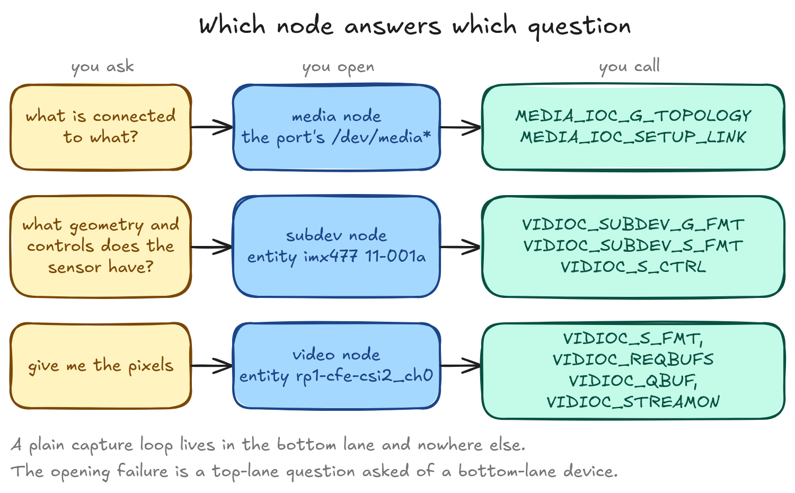
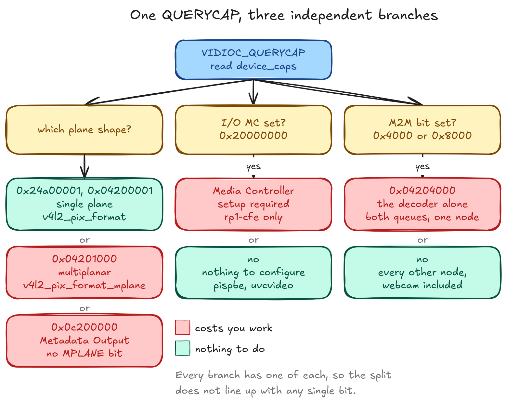
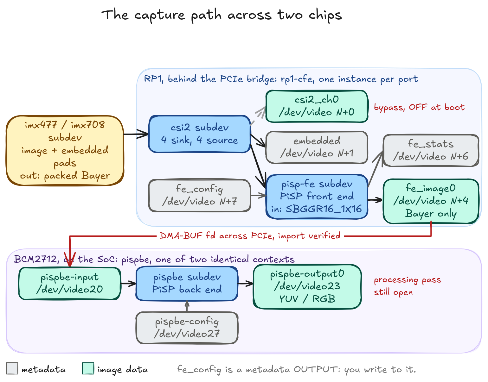
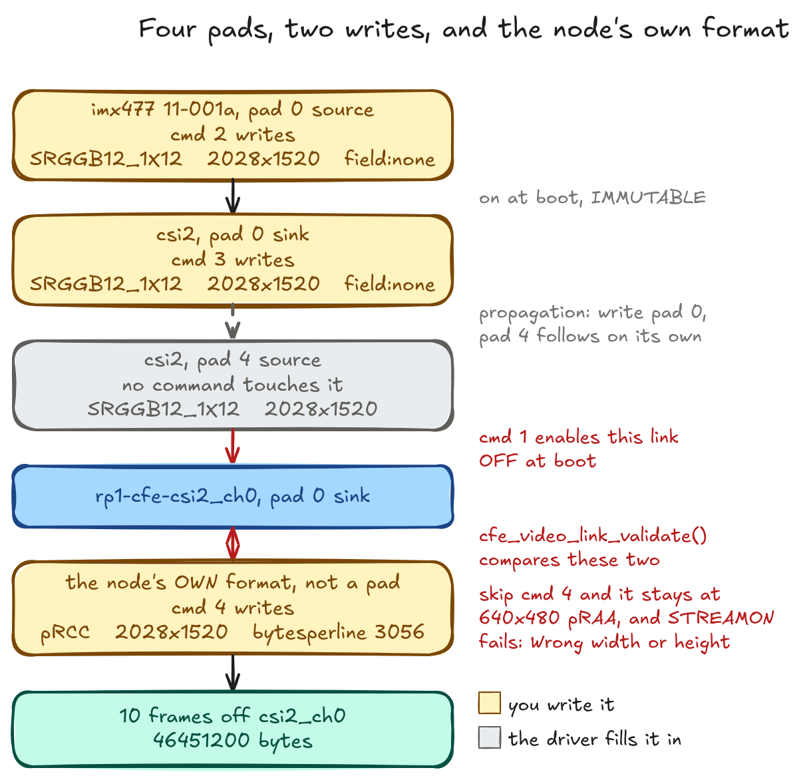
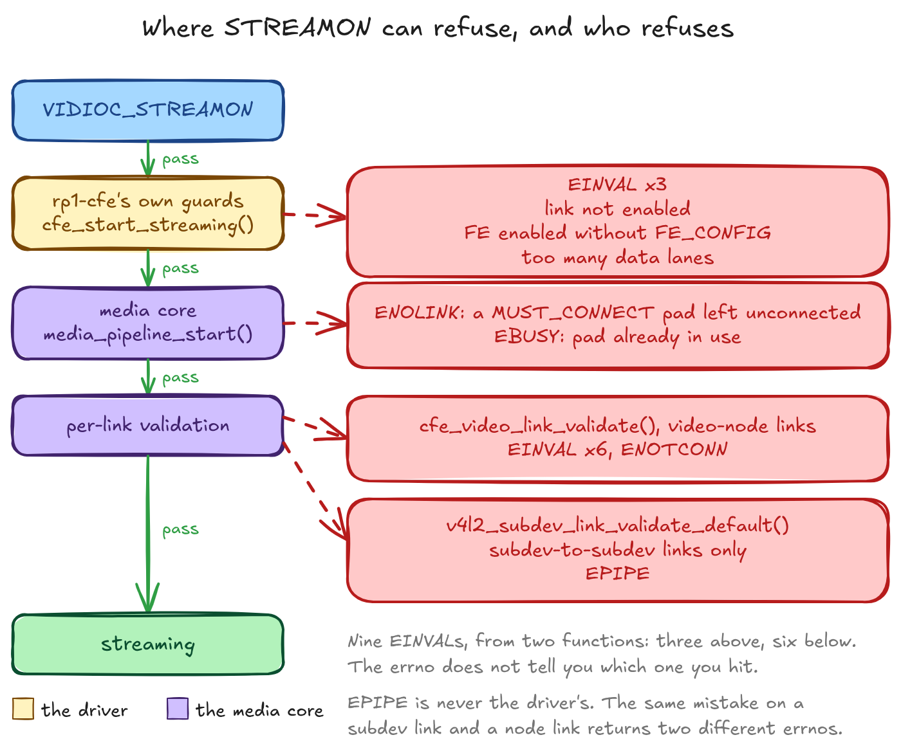
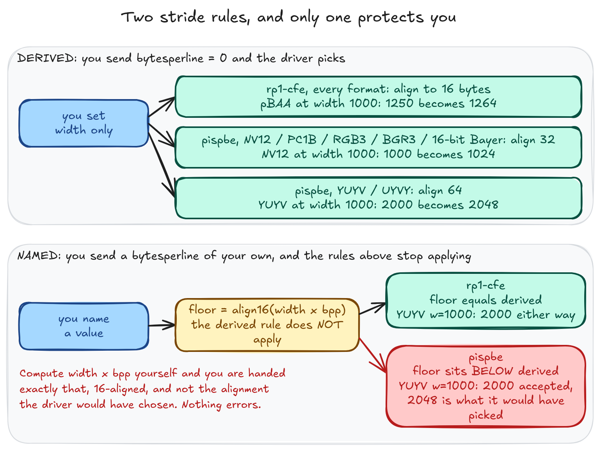
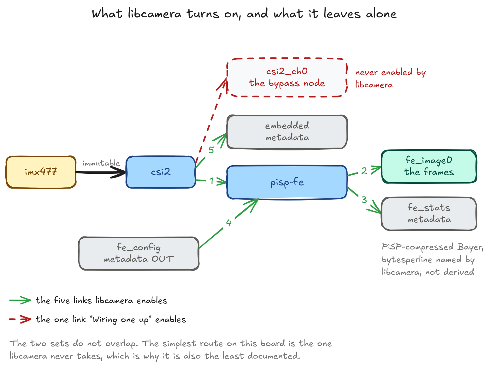

# A3: The Linux Camera Stack

V4L2 device nodes, capability bits, the Media Controller graph, stride and buffer ownership, and the block topology of the Pi 5 capture path.

> **Platform note:** Everything here is measured on one Raspberry Pi 5 running one kernel, with the exact versions listed at the end. Most of what follows is a number, and numbers age. The shapes generalise. The node numbers absolutely do not.

---

## What this page is

Every frame this book captures arrives through V4L2, and V4L2 has a vocabulary the capture code uses without stopping to define it. This page is where it gets defined.

It sits between two other appendices. A1 is underneath it, at the sensor: Bayer order, bit depth, packed MIPI formats, sensor modes. Nothing here restates that. A5 will sit above it, at controls and the 3A loops. This page covers what is in between, which is the kernel's side of the boundary: the ioctl surface, the Media Controller graph, and the specific block topology of one Raspberry Pi.


Here is the failure that sends people looking for a page like this:

```
$ v4l2-ctl -d /dev/video0 --set-fmt-video=width=1920,height=1080
$ v4l2-ctl -d /dev/video0 --get-fmt-video
	Width/Height      : 1920/1080

$ v4l2-ctl -d /dev/video0 --stream-mmap --stream-count=1
VIDIOC_STREAMON returned -1 (Invalid argument)

$ dmesg | tail -1
rp1-cfe 1f00128000.csi: csi2_ch0 node link is not enabled.
```

Setting the format worked. Reading it back worked, geometry unchanged. Only `STREAMON` fails, with `EINVAL` and a kernel message naming something most V4L2 tutorials never mention.

Nothing you did was wrong. The node exists, the format is supported, and the ioctl order matches every V4L2 capture example written in the last fifteen years.

What's missing is a step those examples don't have, and the reason they don't have it is that they assume a device with one path through it. One source, one destination, nothing to choose between. On hardware shaped like that, opening the node and setting a format really is the whole job, and V4L2's original model fits it exactly.

The CSI-2 capture path is not shaped like that. Each of the Pi 5's two camera ports presents eight video nodes, because a CSI-2 receiver has more than one route out of it.

Nothing in the request you made says which of those routes you meant. So the kernel connects none of them, and it does that by default rather than as a failure: at boot the only live connections on the graph run from the sensor to the receiver, and every route onward from there is off. The node you opened is a real device, correctly configured, wired to nothing.

That is a property of this path and not of the board, which is the first thing worth internalising: the ISP behind this receiver needs no such setup, and neither does a USB webcam in the same machine. One capability bit tells you which kind you are holding.

If you only came here to unblock that, the fix is four commands and they are in "Wiring one up" below. The rest of this page is why they are needed, and why nothing before `STREAMON` complained.

What sits in that gap is independent enough that you can understand one part and still be stuck on the rest. There is the ioctl surface: what you can ask a V4L2 device, and which questions this driver refuses to answer at all. There is the Media Controller model, where the enabled-link problem lives, and which most V4L2 documentation treats as an advanced topic you can skip. And there is the specific hardware in front of you, which on a Pi 5 means two CSI-2 receiver instances inside a PCIe-attached I/O chip, a PiSP front end sharing a media graph with them, and a back end on the SoC that does memory-to-memory work while failing the kernel's own definition of a memory-to-memory device.

Most of what cost me time was in the third category and looked like it was in the first.

---

## What is actually on the board

Start where every V4L2 walkthrough starts. On this board the answer is longer than a walkthrough has any use for.

```bash
v4l2-ctl --list-devices
```

```
pispbe (platform:1000880000.pisp_be):
	/dev/video20
	/dev/video21
	      ⋮        (through /dev/video35)
	/dev/media0
	/dev/media4

rp1-cfe (platform:1f00110000.csi):
	/dev/video8
	      ⋮        (through /dev/video15)
	/dev/media1

rp1-cfe (platform:1f00128000.csi):
	/dev/video0
	      ⋮        (through /dev/video7)
	/dev/media2

rpi-hevc-dec (platform:rpi-hevc-dec):
	/dev/video19
	/dev/media3
```

Four blocks, node lines elided inside each.

Two CSI cameras are attached and nothing is plugged into USB, and on that configuration the board presents 33 video nodes. Almost none of them is the one you want, and nothing in that listing tells you which is.

If that printed nothing, it is permissions, and the fix is one line: put yourself in the `video` group. Every node on the camera path is owned `root:video` with mode `0660`, video nodes and media nodes and subdevs and the dma-heaps alike, so there is nothing to `chmod`. That one group is also enough on its own. A process running as an ordinary user with `video` as its only supplementary group drives a libcamera capture end to end, so nothing on the capture path needs `render` or `sudo`; strip the group and the same process cannot even open `/dev/video0`.

### Three kinds of device node, and only one of them is familiar

The listing above mixes two kinds of path, and there is a third it does not print at all.

Video nodes at `/dev/video*` are the ones capture code talks to. You set a format on one, queue memory to it, and frames come back. That is the whole of the API a single-camera capture loop needs.

Subdev nodes at `/dev/v4l-subdev*` are new here. They expose the internal blocks: the sensor itself, the CSI-2 receiver, the PiSP front end, and on a module that has one, the focus actuator. A subdev has no buffer queue. What it has is pads, each carrying its own format, and controls. The sensor's geometry and its exposure controls live on a subdev, not on the video node you capture from.

Media nodes at `/dev/media*` are also new, and they are the ones that answer the question the failure above raised. A media node carries the graph: which entities exist, which pads each has, and which pads are connected to which. It is the only place the connection state lives.



Each question goes to its own device node, and the three ioctl families do not overlap. A plain capture loop lives in the bottom lane and nowhere else. The failure this page opened with is a question in the top lane, asked of a device in the bottom lane, which is why the answer came back as an unhelpful `EINVAL`.

One `rp1-cfe` port is one media node describing one graph, containing the sensor subdev, the `csi2` subdev, the `pisp-fe` subdev, and eight video-node entities. `media-ctl -p` prints the whole thing, but which `/dev/media*` to hand it is exactly the question the next section says never to answer with a constant, so find it by what is inside it:

```bash
for m in /dev/media*; do
  media-ctl -d "$m" -p 2>/dev/null | grep -q '"imx477' && M="$m"
done
media-ctl -d "$M" -p
```

That `$M` is the one every later command on this page uses.

### Why two cameras produce thirty-three video nodes

The listing prints four blocks, but it groups by bus address rather than by driver, and only three drivers are behind them.

`rp1-cfe` drives the Camera Front End, the CSI-2 receiver. One instance sits at each camera port's bus address, and each registers a whole block of video nodes, because a receiver has more than one route out: straight to memory, through the PiSP front end, or off to one of the metadata side channels. Two addresses, two blocks. `pispbe` drives the PiSP back end, the image signal processor that turns raw sensor output into something a display or an encoder can use, and it registers two independent processing contexts. Both answer to the same bus address, `platform:1000880000.pisp_be`, so the listing folds them into one block. `rpi-hevc-dec` is a video decoder with a single node, present here mostly as a contrast case.

Unfolded, those four blocks are five separate graphs:

| Driver | Hardware | Video nodes | Count | Media nodes |
|---|---|---|---|---|
| `rp1-cfe` | CSI-2 receiver, port 1 (`1f00128000.csi`) | `/dev/video0`–`7` | 8 | one |
| `rp1-cfe` | CSI-2 receiver, port 0 (`1f00110000.csi`) | `/dev/video8`–`15` | 8 | one |
| `rpi-hevc-dec` | HEVC decoder | `/dev/video19` | 1 | one |
| `pispbe` | PiSP back end, first context | `/dev/video20`–`27` | 8 | one |
| `pispbe` | PiSP back end, second context | `/dev/video28`–`35` | 8 | one |

That is thirty-three video nodes and all five media nodes accounted for, with nothing unlisted hiding behind either count.

Read the node ranges in that table as one board's boot, not as addresses. They hold for this set of drivers binding in this order, and the next section breaks them with a single USB cable.

The two `pispbe` rows are worth dwelling on, because the driver gives you nothing to tell them apart. Same bus address, and the entity names inside both graphs are identical down to the last pad: `pispbe-input`, `pispbe-config`, `pispbe-output0` and the rest appear twice, once per context. The node range is the only discriminator, and the media index it lands on changes across boots.

None of those counts is a camera count, and the cheapest way to see that is to attach a third camera. Plug a UVC webcam into USB and the board gains two video nodes, not eight: one carrying frames, one carrying UVC metadata. How many nodes a camera produces is a property of the driver behind it, and `uvcvideo` offers one route where `rp1-cfe` offers several.

So a CSI camera is not a device you open. It is a graph with eight capture routes in it. Which of the eight you want, and how you connect a sensor to it, is the rest of this page.

---

## The numbering is not the map

Here's the trap that costs an afternoon: you write down the node map, you bake it into a test fixture or a config file, you reboot, and half of it has moved.

The counts hold: 33 video nodes, 5 media nodes and 7 subdev nodes, identical on all three boots that took a full census. What is not stable is which index belongs to which piece of hardware.

Seven is worth a second look, because it is an odd number on a board with two symmetric camera ports. Six of the seven are the pair you would predict, a `csi2` and a `pisp-fe` and a sensor on each port. The seventh is `dw9807 10-000c`, the voice-coil focus actuator on the imx708 module, and the imx477 graph has nothing corresponding to it. So the two ports do not hold the same number of subdevs, and the reason is which modules are plugged in, not anything about the board. Even the stable counts are only stable for one hardware configuration.

Across four boots no video-node block moved. Every range in the table above held on all four. The `/dev/media*` indices are what moved.

Two of those boots recorded where every media device had landed, six days apart, and that pair is enough to show the problem. Read it by index rather than by device:

| Media node | Boot A | Boot B |
|---|---|---|
| `/dev/media0` | `pispbe` context | imx708 CFE |
| `/dev/media1` | imx708 CFE | `rpi-hevc-dec` |
| `/dev/media2` | imx477 CFE | imx477 CFE |
| `/dev/media3` | `rpi-hevc-dec` | `pispbe` context |
| `/dev/media4` | `pispbe` context | `pispbe` context |

Three of the five changed hands, and not one went to a device of the same kind. `/dev/media0` carried an ISP context on Boot A and a camera graph on Boot B. `/dev/media3` went the other way. Every video-node block, meanwhile, sat exactly where it had been.

So resolve a media device by driver name, and where two devices share a driver, by the sensor or the node range its graph carries. Pairing a media index with a video index is wrong. Hardcoding either is wrong. Every command in this page resolves media devices by name for exactly this reason.

The recycling is what makes it worth the trouble. A stale index does not fail loudly. It opens something real and wrong, and the first thing you hear about it is an ioctl that makes no sense on a device you did not mean to be talking to.

Four boots is where I stopped believing the video-node blocks were stable, and the fifth boot is why. I left a USB webcam plugged in before powering up. `uvcvideo` bound before either platform driver, took `/dev/video0` and `/dev/video1`, and pushed both CFE blocks up by two:

| Driver | Four boots without USB | One boot with USB present |
|---|---|---|
| `rp1-cfe` `1f00128000.csi` | `/dev/video0`–`7` | `/dev/video2`–`9` |
| `rp1-cfe` `1f00110000.csi` | `/dev/video8`–`15` | `/dev/video10`–`17` |
| `pispbe`, both contexts | `/dev/video20`–`35` | `/dev/video20`–`35` |
| `rpi-hevc-dec` | `/dev/video19` | `/dev/video19` |

Six media nodes on that boot rather than five, because the webcam registers one of its own.

So the rule is not that video-node numbering is stable. It is that video-node numbering is stable for a fixed set of video drivers binding in a fixed order, and a USB camera left plugged in over a reboot is enough to change both. `pispbe` and the decoder held because they bind above the range the newcomer took, which is luck rather than a guarantee.

The practical consequence is worse than it looks, because the displacement is silent and small. Shift by two and `/dev/video2` is still a real capture node that answers `QUERYCAP` and accepts a format. It is just the wrong port.

Entity names and entity IDs do survive a reboot. Every name and every ID in both `rp1-cfe` graphs and both `pispbe` contexts matched exactly between those same two boots, while the media indices carrying those graphs moved underneath them. So an entity is a stable handle and a device index is not.

That doesn't solve the whole problem. Entity names alone will not separate the two `pispbe` contexts, because both carry the identical name set and the identical ID set. Only the video-node range tells them apart.

The tooling has the same problem you do. Run `v4l2-ctl --info` across every node and one `pispbe` context comes back with a topology lookup failure ahead of its capability block:

```
=== /dev/video20 ===
FAIL: could not find device 81:0 in topology
	Device Caps      : 0x04202000
=== /dev/video21 ===
FAIL: could not find device 81:1 in topology
	Device Caps      : 0x04202000
```

Eight nodes of one context, all failing; none of the other. The capability decode is unaffected, so this is cosmetic if all you want is `Device Caps`, and fatal if you wanted the `Interface Info` and `Entity Info` blocks, which are simply absent. Both contexts report the same `Bus info` string, `platform:1000880000.pisp_be`, which is presumably how the lookup gets confused. On the two boots where I captured the sweep, the missed range was `/dev/video20`–`27` both times, sitting on different media indices, so the miss follows the node range rather than the media index. Whether *which* context gets missed varies across boots, I can't tell you: I have one working-notes observation of the other range being missed and I didn't keep its output.

---

## The capability bits decide the code path

`VIDIOC_QUERYCAP` is the first ioctl worth calling and the one most examples skip, because on a webcam the answer is boring. On this board it decides three separate branches in your code.

```bash
for d in /dev/video*; do echo "=== $d ==="; v4l2-ctl -d $d --info 2>&1; done \
  | grep -E "^===|Device Caps|FAIL"
```

Five representative values out of the sweep, and a sixth from a USB webcam attached afterwards:

| Node | `device_caps` | Driver | Shape |
|---|---|---|---|
| `/dev/video0` | `0x24a00001` | `rp1-cfe` | image: single-plane, `I/O MC` |
| `/dev/video4` | `0x24200001` | `rp1-cfe` | front-end image: single-plane, `I/O MC` |
| `/dev/video19` | `0x04204000` | `rpi-hevc-dec` | multiplanar, M2M |
| `/dev/video23` | `0x04201000` | `pispbe` | image: multiplanar capture |
| `/dev/video27` | `0x0c200000` | `pispbe` | config: Metadata Output, no `_MPLANE` |
| the C920's image node | `0x04200001` | `uvcvideo` | image: single-plane, nothing else set |

The webcam is the one to anchor on. `v4l2-ctl` decodes `0x04200001` as `Video Capture, Streaming, Extended Pix Format` and nothing else: the shape every V4L2 tutorial assumes, and the shape none of the five nodes above it has. Every complication on this page is a bit that row does not set.

Two bits in that word are easy to misread. The `0x00200000` is `V4L2_CAP_EXT_PIX_FORMAT`, not `V4L2_CAP_DEVICE_CAPS`, which is `0x80000000` and appears only in the `Capabilities` word, never in `Device Caps`. And the difference between `/dev/video0`'s `0x24a00001` and `/dev/video4`'s `0x24200001` is a single bit, `V4L2_CAP_META_CAPTURE` at `0x00800000`: the bypass node can deliver metadata as well as images, the front-end image node cannot.

Those node numbers are from one boot, and the previous section is why they are not identifiers. The webcam's row carries no number for the same reason, only sharper: where a UVC node lands depends on whether the camera was plugged in before power-up, so any number I gave you would be wrong half the time. Read the table by driver and shape, and resolve the nodes on your own board.

The three branches are independent. `QUERYCAP` is read once and answers all of them; none feeds the next.



Red is where the answer costs you work: build a graph, use the multiplanar struct, handle a metadata-only node, drive two queues. Teal is where there's nothing to do. That split doesn't line up with any one bit, which is the point.

Plane shape needs a word of definition first. A plane is one memory region of a frame. A packed format like `YUYV` interleaves everything into a single region and needs one. A format that separates luma from chroma can put each in its own region, and the kernel allows those regions to sit in separate buffers or even separate memory nodes. V4L2 carries two parallel APIs for the two cases: single-plane uses `V4L2_BUF_TYPE_VIDEO_CAPTURE` with `struct v4l2_pix_format`, multiplanar uses the `_MPLANE` buffer types with `struct v4l2_pix_format_mplane` and its per-plane array. They are not interchangeable, and the node decides which one you write against.

`rp1-cfe` image nodes are single-plane. `pispbe` image nodes are multiplanar. And the two questions come apart: `NV12` on a `pispbe` node reports `Number of planes: 1` despite the `_MPLANE` buffer type, because the contiguous and non-contiguous layouts are different FourCCs and `NM12` is the two-plane one. Size your plane array from `num_planes`, never from the buffer type. Code that hardcodes `_MPLANE` because "it's the Pi camera" breaks on `rp1-cfe`, and code that assumes `_MPLANE` for everything `pispbe` breaks on the two config nodes, `/dev/video27` and `/dev/video35`, which read `0x0c200000`: Metadata Output, no `_MPLANE` bit at all. Not uniform within one driver, let alone across the board.

`V4L2_CAP_IO_MC`, bit `0x20000000`, is what `v4l2-ctl` prints as `I/O MC`. The kernel documentation defines it as: there is only one input and/or output seen from userspace, and the whole topology configuration, including which I/O entity is routed to that input or output, is configured by userspace through the Media Controller.[^querycap] In other words the bit is the driver telling you that opening the node is not enough and you have a graph to build.

It's set on every node of both `rp1-cfe` instances and on no `pispbe` node, which is the entire reason the opening failure happens on the capture front end and never on the ISP back end.

A third case makes the bit predictive rather than merely descriptive. Plug a UVC webcam into the same board and it reports `0x04200001`, without the bit, and streams with no `media-ctl` setup at all. It is not that the webcam has no graph: `uvcvideo` registers one, with a camera terminal, a processing unit, extension units and an output node. Every link in it is `ENABLED,IMMUTABLE`. So the discriminator is not whether a device has a media graph, nor how many entities are in it, but whether the driver hands you any link you are allowed to change. `I/O MC` is the driver answering that question before you touch the graph.

The M2M bit is `0x4000`, `V4L2_CAP_VIDEO_M2M_MPLANE`, and exactly one node sets it: `/dev/video19`, the decoder. The other thirty-two in the sweep do not, and neither does the webcam. I'll come back to why that's more interesting than it sounds, because `pispbe` demonstrably moves frames from memory to memory and transforms them on the way, and still doesn't set the bit.

---

## Two routes out of the camera

The capability sweep left a question open. Why does one driver demand a Media Controller setup while the other offers nothing to configure? The answer is that `rp1-cfe` and `pispbe` are not two flavours of the same block. They are different hardware, doing different jobs, and they are not even on the same side of a PCIe link.

The live device tree says so plainly. Its root `compatible` list reads `raspberrypi,5-model-b` then `brcm,bcm2712`, naming the board model and the SoC on it, and the two capture blocks hang off different buses:

```
pispbe   → /axi/pisp_be@880000
rp1-cfe  → /axi/pcie@1000120000/rp1/csi@128000
```

`pispbe` is on the SoC. `rp1-cfe` is inside RP1, the I/O controller, behind the PCIe bridge. Two hardware blocks, two drivers, two separate platform devices at separate bus addresses, and a PCIe link between them.

The webcam cannot appear in that listing at all, and that is the third case, not an omission. Those paths are `of_node` links, which exist only for devices the device tree describes. A USB camera is not one: `uvcvideo` binds to an interface enumerated on the bus at runtime, so there is no node to point at. Three cameras on one machine, reached by three different discovery mechanisms, which is a large part of why one of them needs `media-ctl` and the others do not.

That is checkable per node rather than inferred. `/sys/class/video4linux/<node>/device/of_node` exists for all three platform drivers and resolves to the paths above, with the decoder at `/axi/codec@800000`, SoC-side alongside `pispbe`. On the webcam's node the path is simply absent.

The CSI-2 receive side is the Camera Front End, driven by `rp1_cfe`, one instance per port, and each instance gets its own media graph and its own eight video nodes. `media-ctl -p` on a graph prints every entity in it together with the `/dev/video*` node that entity owns, which is how the map below was taken and how you would take it on your own board.

Both ports lay out identically, so the table reads as offsets from the port's first node rather than as the absolute numbers `media-ctl` prints:

| Offset | Node | Kind |
|---|---|---|
| `+0` | `csi2_ch0` | image capture, bypasses the front end |
| `+1` | `embedded` | metadata capture |
| `+2`, `+3` | `csi2_ch2`, `csi2_ch3` | image capture, further `csi2` source pads |
| `+4`, `+5` | `fe_image0`, `fe_image1` | front-end image capture |
| `+6` | `fe_stats` | metadata capture |
| `+7` | `fe_config` | metadata **output** |

The `csi2_ch*` nodes take frames straight to memory. The `fe_image*` nodes take them through `pisp-fe`, the PiSP front end, which is a subdev entity sitting inline inside the same graph. `fe_config` is the odd one: a metadata *output* node, meaning the application writes to it rather than reading from it, because the front end needs a configuration buffer pushed in before it will do anything.



Grey is metadata, teal is image data. That's the distinction people get wrong, because `fe_config` sits in a block of eight nodes that look interchangeable from the numbering and isn't one of them.

Which route you take decides what you can get out. A front-end image node offers 10 formats, all Bayer or mono: no YUV, no RGB. The back end's nodes offer 50, including YUV at three subsamplings. So debayering happens in the back end, and if you want anything but raw off the front-end route, you cannot have it there. How the back end does it, stage by stage, is covered in A2 on the ISP pipeline, planned.

The back end sits outside this graph entirely. Each `pispbe` context reads a finished frame out of memory through `pispbe-input`, takes a configuration buffer through `pispbe-config`, and writes the processed result back through one of its outputs. There are two such contexts, `/dev/video20`–`27` and `/dev/video28`–`35`. Neither needs any `media-ctl` work, for reasons the memory-to-memory section gets to.

That hop between the two blocks is the one worth testing rather than assuming, because it crosses the PCIe boundary. Half of it now works end to end. `csi2_ch0` captured a real frame, `EXPBUF` returned a descriptor, and `pispbe-input` accepted that descriptor at `QBUF` under `V4L2_MEMORY_DMABUF` with `STREAMON` succeeding on the imported queue. The fd is handed across, not copied.

What that does not establish is a completed processing pass, which needs a valid configuration buffer on `pispbe-config` and is still open further down this page. So the handoff is verified and the round trip is not.

One trap on the way there, worth more than the result. The first attempt used `pRCC` on both sides. `pispbe-input` does not enumerate it, `S_FMT` returned 0 having silently substituted `YU12`, and `QBUF` then failed `EINVAL` because the exported buffer was smaller than the substituted format needed. The import works only where both drivers enumerate a common FourCC, `RG16` here. `S_FMT` returning zero does not mean it took the format you asked for; read back what you got.

---

## Wiring one up

This is the section the opening failure was waiting for.

`csi2_ch0 node link is not enabled` is a complete description of the problem once you know what a link is, and opaque before. An entity is a hardware or software building block. A pad is a data connection endpoint on an entity. A link is a point-to-point connection from a source pad to a sink pad.

At boot, an `rp1-cfe` graph has two enabled links, and both run from the sensor to `csi2`: the image pad to `csi2` pad 0, and the embedded-data pad to `csi2` pad 1. Both read `ENABLED,IMMUTABLE`, so neither can be disabled. Every `csi2`-to-video-node link and every `csi2`-to-`pisp-fe` link is off. Both ports were dumped at boot and agree.

So the bypass route needs one link enabled and the formats along it made to agree:

```bash
media-ctl -d "$M" -l '"csi2":4->"rp1-cfe-csi2_ch0":0[1]'
media-ctl -d "$M" -V '"imx477 11-001a":0 [fmt:SRGGB12_1X12/2028x1520 field:none]'
media-ctl -d "$M" -V '"csi2":0 [fmt:SRGGB12_1X12/2028x1520 field:none]'
v4l2-ctl -d "$V" --set-fmt-video=width=2028,height=1520,pixelformat=pRCC
```

The `media-ctl` syntax is `"entity":pad`, and everything else follows from that. `-l` operates on a link and takes both ends plus a flag: `"csi2":4->"rp1-cfe-csi2_ch0":0[1]` means pad 4 of `csi2` to pad 0 of the video node, and `[1]` turns it on. `[0]` turns it off. `-V` operates on one pad and gives it a format: a media-bus code, a geometry, and a field order.

| Command | Reaches | Does |
|---|---|---|
| `-l ... [1]` | the link between `csi2` pad 4 and the node's pad 0 | enables it; it is off at boot |
| `-V` on `imx477:0` | the sensor's source pad | sets what the sensor will emit |
| `-V` on `csi2:0` | the receiver's sink pad | sets what the receiver expects |
| `--set-fmt-video` | the video node's own format | sets what the node will write to memory |

Stop after the three `media-ctl` calls and you get the opening failure again, wearing a different message. All three return 0. Every pad on the path reads `SRGGB12_1X12/2028x1520 field:none`. And `STREAMON` fails:

```
VIDIOC_STREAMON returned -1 (Invalid argument)
rp1-cfe 1f00128000.csi: Wrong width or height 640x480 (remote pad set to 2028x1520)
rp1-cfe 1f00128000.csi: Failed to start media pipeline: -22
```

The video node was never told anything. It is still sitting at the 640×480 `pRAA` it had at boot, because a node's format is not a pad format and nothing propagates into it. `cfe_video_link_validate()` compares the two and refuses the mismatch. So the fourth command is not a convenience, and a pipeline where every pad agrees can still be a pipeline that will not start.



Four pads sit on that path and only two get written, because `csi2` propagates its sink pad to its source pad. That is measured, not assumed: write `csi2:0` alone and `csi2:4` moves with it in both media-bus code and geometry, with no command naming pad 4. Propagation is a property of the subdev, not something you perform. An explicit write to pad 4 afterwards does stick, though, and is not clobbered by the propagated value, which is how a pipeline ends up with a 12-bit sink pad and a 16-bit source pad.

The format to write comes from the sensor, never from the video node. Ask `/dev/video0` what it takes and it lists 41 formats including `YUYV` and `RGB3`, none of which the sensor can produce: that list is the driver's format table, not a capability list for the pipeline the node currently sits in. Ask the sensor subdev with `VIDIOC_SUBDEV_ENUM_MBUS_CODE` and you get the truth, with one catch, which is that the answer moves. Set both IMX477 flips and the pad enumerates `SBGGR12_1X12`; clear them and the same pad enumerates `SRGGB12_1X12`. Bayer order rotates with the flips, so an enumeration cached at startup is wrong the moment you touch them.

And the third command hides a trap. Drop the `field:none` token and the pad is left at `Any`, which mismatches the sensor's `None`, and that alone fails `STREAMON`. Two runs differing by that one token, same links and same geometry and same media-bus code: one captures, one does not, and nothing in the command output tells you which you wrote.

With the graph reduced to the intended path and the formats matched, the node streams: ten frames off `csi2_ch0` at 2028×1520, 46451200 bytes, which is ten times the `sizeimage` the node reports.

The other extreme is on the same board. All sixteen `pispbe` links read `ENABLED,IMMUTABLE`, so no configuration is possible and none is needed. That is the `I/O MC` split from the capability section showing up as the difference between an afternoon and no work at all.

---

## When it fails

The failure you should expect is not an error.

You build the graph, set the formats, `STREAMON` returns 0, and nothing arrives. Not an error code, not a kernel message, not a partial frame. Four of the five links a real `rpicam-hello` run leaves behind will do exactly that, and the runs here waited eight seconds before giving up.

When you do get an errno, check `dmesg` before anything else, because `rp1-cfe` is unusually talkative about its own refusals. Four failure paths were triggered deliberately and all four named a reason in the log, including the one that returns `EPIPE` rather than `EINVAL`:

| What was wrong | errno | What the log said |
|---|---|---|
| link not enabled | `EINVAL` | `csi2_ch0 node link is not enabled.` |
| video node's format not set | `EINVAL` | `Wrong width or height 640x480 (remote pad set to 2028x1520)` |
| `field:` token omitted from a pad | `EPIPE` | `Failed to start media pipeline: -32` |
| front end without its config node | `EINVAL` | `FE enabled, but FE_CONFIG node is not` |

The driver's own messages go through `cfe_err()` to `dev_err()` and print whatever the build options are. What does compile away in this kernel, which has `CONFIG_DYNAMIC_DEBUG` unset, belongs to the media core and `v4l2-subdev.c`, so the specific link the core rejected can be missing while `cfe.c` still prints its own line carrying the errno.

The errno itself does not partition the causes. `EINVAL` alone covers nine distinct failures, three of them raised by the driver's own guards before the pipeline starts and six by its link validator.



`MUST_CONNECT` in that second lane is a pad flag, set on every `rp1-cfe` node entity's pad, and it means the core will refuse to start a pipeline that leaves the pad unconnected rather than quietly streaming nothing.

`EPIPE` is never the driver's; it comes from the subdev comparator in the core and reaches you only on a subdev-to-subdev link, so the same mistake on two different links returns two different errnos. And failure does not always wait for `STREAMON`: the metadata output node fails at `QBUF`, logging `Input config not valid`, which has already happened by the time you are watching `STREAMON`.

---

## Reading the buffer

Stride and buffer ownership both sit between a queued buffer and a correct pixel, and neither one makes the capture loop fail. Get both wrong and the ioctls still return zero.

Never compute the stride. The driver returns `bytesperline` and it is not width times bytes per pixel: `rp1-cfe` aligns every format to 16 bytes, `pispbe` aligns most formats to 32 and `YUYV` and `UYVY` to 64.



`RG16` and `YUYV` are both two bytes per pixel, sit on the same node, and take different rules. So the alignment class is not a function of the format's depth and a client cannot compute the stride at all. It has to ask, per format. The format catalogue itself, and the plane-layout arithmetic that goes with it, is A4's subject, planned.

What makes that advice load-bearing rather than fastidious is what happens when you ignore it. Name a `bytesperline` yourself and the driver does not clamp you up to the value it would have chosen. It clamps you to a floor of `width × bytes-per-pixel` rounded up to 16, and on `pispbe` that floor sits *below* the derived stride for every format in the 32-byte and 64-byte classes:

| Node | Format | width | driver derives | floor it will accept |
|---|---|---|---|---|
| `pispbe` | `YUYV` | 1000 | 2048 | **2000** |
| `pispbe` | `UYVY` | 100 | 256 | **208** |
| `pispbe` | `NV12` | 1000 | 1024 | **1008** |
| `pispbe` | `RGB3` | 260 | 800 | **784** |
| `rp1-cfe` | `YUYV` | 1000 | 2000 | 2000 |
| `rp1-cfe` | `pRCC` | 1000 | 1504 | 1504 |

So a client that computes `width × bpp` and passes it is handed exactly that, and on `pispbe` it is handed a stride the driver would never have picked. On `rp1-cfe` the floor and the derived value coincide for every format tested, so the same mistake is invisible there. The undersized stride the "never compute it" rule exists to prevent is reachable, on one of the two drivers, through the API.

Ownership is the other one. `QBUF` gives the buffer to the driver, `DQBUF` takes it back, and between those calls it is not yours. Nothing enforces that but you. `DQBUF` blocks until a buffer is ready, unless the node was opened `O_NONBLOCK`, in which case it returns `EAGAIN` straight away and waiting becomes your job through `poll()`. What comes back attached to a dequeued buffer, the timestamps and sequence numbers and how to tell a dropped frame from a late one, is A6's subject, planned. For multiplanar formats the mapping is per plane rather than per buffer, so the loop bound is `num_planes` and not the buffer type.

On allocation, every platform node here advertises `mmap` and `dmabuf` and a cap of 32 buffers, and none advertises `userptr`. `REQBUFS` allocates the buffers, and the offset and length you hand to `mmap` come from `VIDIOC_QUERYBUF` per buffer, or per plane on a multiplanar node. The webcam is the exception and the only one: its buffer caps read `0x17` against `0x15` on every `rp1-cfe` and `pispbe` node, and the extra bit is `SUPPORTS_USERPTR`. `REQBUFS` with `V4L2_MEMORY_USERPTR` returns 0 on the C920 and `EINVAL` on all four platform nodes tested.

That rules out one mechanism and not the general case. `REQBUFS` with `V4L2_MEMORY_DMABUF` returns 0 on every platform node, so you can hand these drivers your own allocation; you just cannot hand them a raw userspace pointer. Export works too and the fd is real: `EXPBUF` returns zero on both `rp1-cfe` node classes and both `pispbe` queue directions, `fstat` reports a page-aligned size, `mmap` on the descriptor succeeds. The size is exactly `sizeimage` rounded up to a page, with no slack, once you use this board's real page size: `getconf PAGESIZE` reads 16384, not 4096.

---

## You have raw frames. Now what?

Capture gets you Bayer. Almost nothing downstream wants Bayer, so the next two questions are where to debayer it and where to encode it. This board answers one of them well and the other not at all.

Debayering is the ISP's job, and that is a memory-to-memory operation: hand a buffer to hardware, get a different one back. So the reasonable move is to find an M2M device and drive it.

You will not find one. The kernel's definition needs one video node carrying both queues, the `V4L2_CAP_VIDEO_M2M` bit or its `_MPLANE` variant, and `STREAMON` on both;[^mem2mem] `pispbe` fails all three while doing the job anyway, splitting its queues across separate nodes, setting no M2M bit, and not linking `v4l2_mem2mem` at all. The only node on this board that meets the definition is the HEVC decoder, and the codec API it fronts is A8's subject, planned.

What `pispbe` does instead needs no Media Controller work whatsoever. Open the input, config and output nodes, `S_FMT` on all three, allocate, `STREAMON`, and buffers come back. A frame goes in as compressed Bayer at 2028×1520 and comes out as planar YUV at 640×480, and under libcamera's own configuration every buffer queued in came back out.

The one thing not shown is a processed frame from a configuration the application built itself. A hand-built run got its input and config buffers back clean and nothing at all on the output: poll timed out at 2000 ms and again at 5000 ms. Whether that config was valid is unresolved, and the driver cannot be asked on this kernel.

While you are here: **no hardware video encoder is exposed on this board**, scoped to this unit with the overlays it boots. Asking all four queue directions of all 33 nodes returns 989 format entries, of which exactly one is a non-PiSP compressed format, and it sits on the decoder's input queue. Encoding on this board is a software problem.

---

## Why libcamera works when your code does not

`rpicam-hello` captures frames. Whatever you built by hand may not. Both drive the same kernel interfaces, so the difference is entirely in what libcamera configures.

That configuring is not generic code. libcamera carries a pipeline handler per platform, and the one that claims this board is `rpi/pisp`: it knows the entity names, which links to enable, and what to write on each pad. Bound to the handler is an IPA module, the out-of-process component that runs the 3A algorithms. Two are installed here, `ipa_rpi_pisp.so` and `ipa_rpi_vc4.so`, each with a `.sign` signature file beside it, and the binding is by declared name rather than by filename: `IPAModule::match()` compares the module's own `pipelineName` string against the handler's name,[^ipamatch] so the two modules declare `rpi/pisp` and `rpi/vc4` and what the files are called does not enter into it. `rpi/vc4` would not match on this board in any case, because it looks for media devices named `unicam` and `bcm2835-isp`, and neither name is present here.

So "libcamera works" means a handler written against this exact topology, a tuning file, and an algorithm module bound to it by name. None of that is reachable by writing better V4L2 calls, which is the real reason a hand-built pipeline and `rpicam-hello` are not competing at the same thing.

It is also where the frame-rate table lives, because V4L2 does not have one: `VIDIOC_ENUM_FRAMEINTERVALS`, `G_PARM` and the subdev interval enumeration all return `ENOTTY`, read at the ioctl rather than through `v4l2-ctl`, which reports any failure as end of list. All three are absent, not empty, and the tool cannot show you the difference. libcamera advertises a figure per sensor mode and delivers it, 120.13 fps advertised against 120.12 measured on the IMX708 at 1536×864.

It takes the front-end route, not the bypass one, and enables five links to do it:



Compare that against the single link "Wiring one up" enables. Five instead of one, and the extra four are the front end, the configuration buffer it needs pushed in before it will do anything, and two metadata side channels. The `csi2_ch0` bypass node is never used, so the simplest route on this board is also the least travelled. It commits PiSP-compressed Bayer out of the front end and not unpacked raw, and it names its own `bytesperline` rather than letting the driver derive one.

Those five links stay enabled after it exits, so a libcamera run before yours changes the state your run starts from. And it writes to your sensor during plain enumeration, before any stream is configured: `CameraSensorLegacy::init()` clears the flips and pins horizontal blanking to its minimum where the control is writable.[^sensorlegacy] On this board the IMX477's blanking is writable and gets changed; the IMX708's is read-only and does not. Since the flips decide which Bayer codes the sensor enumerates, even a bare `rpicam-hello --list-cameras` leaves state behind that your own enumeration will read back.

---

## Glossary

These definitions bind. An article citing this page for any of them should find the same definition here.

**CFE, Camera Front End.** The CSI-2 receive block inside the RP1 I/O controller, behind the PCIe bridge rather than on the SoC, driven by `rp1-cfe`. One instance per CSI-2 port, each with its own media graph and its own block of eight video nodes. It receives CSI-2 packets, optionally routes them through the PiSP front end, and writes the result to system memory. Every CFE node sets `V4L2_CAP_IO_MC`, and CFE image nodes are single-plane. No `unicam` module is loaded on this board; that `unicam` is the pre-Pi-5 equivalent of the CFE is unverified here and must not be asserted by an article citing this page.

**PiSP front end (`pisp-fe`) and back end (`pispbe`).** Two distinct hardware blocks with two distinct drivers, reported as separate platform devices at separate bus addresses. The front end is a subdev entity with five pads inside the `rp1-cfe` media graph: it sits inline between the CSI-2 receiver and memory, produces Bayer, PiSP-compressed Bayer or mono plus a statistics buffer, and consumes a configuration buffer. It emits no YUV and no RGB. The back end is a separate platform device on the SoC side, reached through its own media graph, that reads a frame from memory and writes the result back. Its input and output nodes enumerate the same 50-format list, so its input is not restricted to Bayer, and its links are all immutable: there is nothing to configure with `media-ctl` and nothing that needs it.

**M2M, memory-to-memory device.** The V4L2 device class in which one video node carries both an OUTPUT queue, data the application sends to the hardware, and a CAPTURE queue, processed data it reads back; advertised by `V4L2_CAP_VIDEO_M2M` or `V4L2_CAP_VIDEO_M2M_MPLANE`, and started by `VIDIOC_STREAMON` on both queues. The queue names are from the driver's point of view: OUTPUT is what the application writes. `/dev/video19` is the only node on this board that is one. `pispbe` is not, in this sense: it fails all three structural tests while performing the function.

**`I/O MC`, `V4L2_CAP_IO_MC`.** The capability bit `0x20000000`, printed by `v4l2-ctl --info` as `I/O MC`, declaring that the node presents a single input or output and that the routing behind it is configured by userspace through the Media Controller. Set on every `rp1-cfe` node and on no `pispbe` node.

**Stride, and `bytesperline`.** The distance in bytes between the leftmost pixels of two adjacent lines, as the driver returns it in `v4l2_pix_format`, and per plane in `v4l2_pix_format_mplane`'s `plane_fmt[]` array for the multiplanar API. Stride in this book means that returned value and nothing else, never a value the application computed. A driver may return more than width times bytes per pixel, and both drivers here do.

**Plane, and multiplanar.** A plane is one memory region of a frame, each able to reside in a separate memory buffer or even a separate memory node. Multiplanar describes the API variant: buffer types ending `_MPLANE`, structures `v4l2_pix_format_mplane` and `v4l2_plane[]`. The API variant is a property of the device node; the number of planes is a property of the format. A multiplanar node can report a single-plane format.

**DMA-BUF, against mmap.** mmap streaming maps driver-allocated buffers into the process address space, and the application and driver exchange ownership through `VIDIOC_QBUF` and `VIDIOC_DQBUF`; only pointers are exchanged, the data is not copied. DMA-BUF shares one buffer between kernel subsystems as a file descriptor: the owner exports it with `VIDIOC_EXPBUF`, and an importer switches to `V4L2_MEMORY_DMABUF` at `VIDIOC_REQBUFS` and queues the descriptor rather than an index. Every node checked here advertises both mmap and dmabuf. No `rp1-cfe` or `pispbe` node advertises `userptr`; the UVC node is the only one on this board that does.

**Media entity, pad, link.** An entity is a hardware or software building block. A pad is a data connection endpoint on an entity. A data link is a point-to-point oriented connection from a source pad to a sink pad. Two further terms are this page's own shorthand rather than the kernel's: a subdev is an entity with a control interface at `/dev/v4l-subdev*`, and a node entity wraps a `/dev/video*` device node.

---

## What this was measured on

| | |
|---|---|
| Board | Raspberry Pi 5 Model B Rev 1.1 |
| Kernel | `6.12.47+rpt-rpi-2712`, aarch64 |
| Media Controller API | 6.12.47, reported by all five media devices |
| `v4l2-ctl`, `media-ctl` | 1.30.1 |
| Sensors | IMX477 on one port, IMX708 on the other |
| libcamera | `0.5.2+rpt20250903-1+b1`, build `v0.5.2+99-bfd68f78` |
| rpicam-apps | 1.9.1, distribution package |
| Kernel source read at | `dbe6dc7e9a75` on `rpi-6.12.y` |

That last row carries a caveat of its own. The board runs `6.12.47` and the branch has moved well past it, so a driver detail read at that commit is not guaranteed to describe the running kernel; where a claim rests on source rather than on a measurement, it says so. And `CONFIG_DYNAMIC_DEBUG` is unset in this build, which is why most of the driver's diagnostic messages never reach the log.

---

## What this page does not establish

These are open questions rather than omissions, because a reference page that quietly drops its gaps is worse than one that names them.

The hand-built back-end pass is the big one, and it now blocks a second question behind it. libcamera's own configuration completes a pass; a configuration built by the application did not, returning its input and config buffers clean and nothing at all on the output. Whether that config was valid is unresolved, and the driver cannot be asked on this kernel for the reasons in the errno section. Until it resolves, the `rp1-cfe` to `pispbe` zero-copy path is verified only as far as the import: the descriptor crosses and the queue starts, and no processed frame has come out the far end of one.

Cache coherency around that path is a sourcing failure, not a measurement gap. Whether `DMA_BUF_IOCTL_SYNC` is required around CPU access to an imported buffer, because BCM2712 DMA is not cache-coherent, is a claim I could not stand up: no round trip with CPU reads was executed, and no citable vendor document states the coherency property either way.

The rest are simply out of reach here. Sustained power draw by workload, and the cooling class each needs, with no measurement equipment available. What the equivalents are on a Raspberry Pi 4, which is the substitution I am most likely to get wrong by analogy and least able to check, with no Pi 4 to hand. And the rate at which the two blocks sustain concurrent dual-camera capture: each port is wired for two data lanes and the driver logs `Using a link rate of 900 Mbps` per lane, so the budget is 1.8 Gbit/s per port, but what the pair actually sustains together was never measured.

---

## Further Reading

- [Video4Linux API reference](https://www.kernel.org/doc/html/latest/userspace-api/media/v4l/v4l2.html)
- [Media Controller API reference](https://www.kernel.org/doc/html/latest/userspace-api/media/mediactl/media-controller.html)
- [libcamera documentation](https://libcamera.org/)
- [Raspberry Pi camera software documentation](https://www.raspberrypi.com/documentation/computers/camera_software.html)
- [raspberrypi/linux](https://github.com/raspberrypi/linux), the tree every driver-source claim on this page was read from
- **Next:** A5, V4L2 controls and the 3A loops (planned), where the sensor writes this page keeps mentioning stop being a side effect and become the subject

---

[^querycap]: `Documentation/userspace-api/media/v4l/vidioc-querycap.rst`, `raspberrypi/linux` at `dbe6dc7e9a75` on `rpi-6.12.y`.

[^mem2mem]: `Documentation/userspace-api/media/v4l/dev-mem2mem.rst`, same tree and commit.

[^ipamatch]: `src/libcamera/ipa_module.cpp`, `IPAModule::match()`, `raspberrypi/libcamera` branch `v0.5.2+rpt20250903`.

[^sensorlegacy]: `src/libcamera/sensor/camera_sensor_legacy.cpp`, `CameraSensorLegacy::init()`, `raspberrypi/libcamera` branch `v0.5.2+rpt20250903`.
