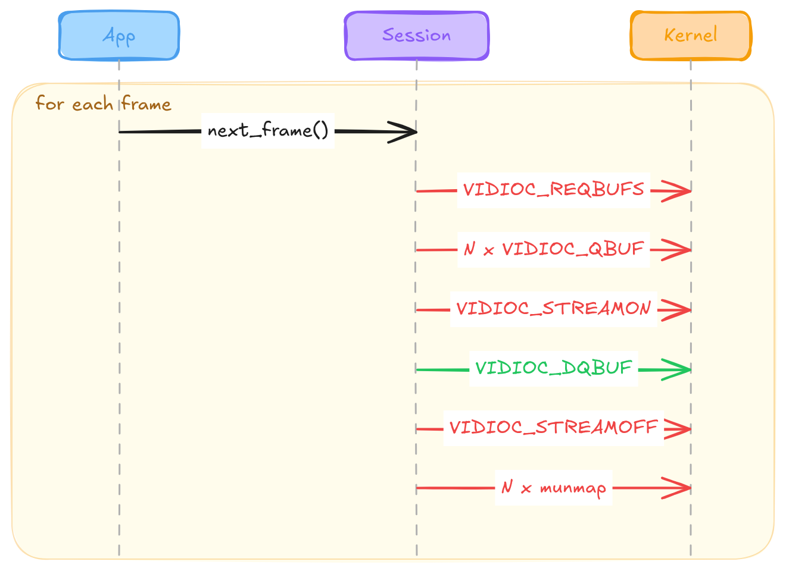
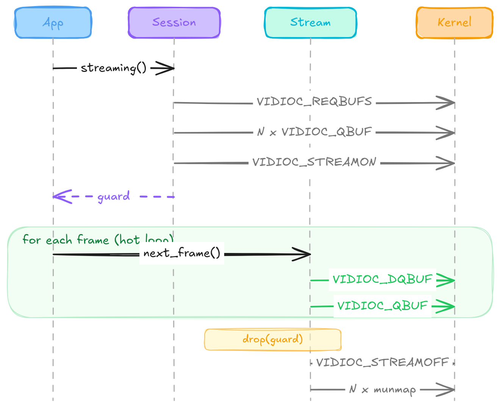

# V4L2 in Rust: what `forbid(unsafe_code)` cost me, and what it bought

Rust is billed as a memory-safe language. Every talk, every marketing page, every keynote leans on that. So when I added `unsafe_code = "forbid"` to `pi-cam-capture`'s `[lints.rust]` in `Cargo.toml`, I meant it. Not "as much as possible." Not "except at FFI boundaries." Forbidden.

About a week into the streaming layer, the borrow checker made me pay for that decision. And, on the way through, wrote a better API than the one I was about to ship.

This one's a side note from the Glass-to-Glass series[^g2g], not part of the main capture engine article. The main-line piece[^g2g-capture] shows the final `CaptureSession` and moves on. This is the design debate that led there.

## What V4L2 streaming actually needs

V4L2 memory-mapped streaming is a kernel-side resource. You ask the driver to allocate a fixed pool of buffers, you `mmap` them into userspace, you queue them, you `VIDIOC_STREAMON`, and then you drain filled buffers in a tight loop and requeue. When you're done, `VIDIOC_STREAMOFF`, then `munmap` everything. The `v4l` crate wraps that faithfully, and its `Stream<'a>` takes a `&Device`, because a stream cannot exist without the device whose buffers it holds.

The whole reason V4L2 has this shape is amortization. Allocation is expensive. Mapping is expensive. The steady state is supposed to be one DQBUF, process, QBUF, repeat. Everything else is setup and teardown.

The point I need for the rest of this article is smaller: `Stream<'a>` borrows the device, and any wrapper above `v4l` that tries to hide both behind a single type walks straight into a self-referential struct.

<!-- more -->

## The naive API

Here's the shape I sketched first, before thinking too hard:

```rust
pub struct CaptureSession {
    device: V4L2Device,
    config: CaptureConfig,
}

impl CaptureSession {
    pub fn next_frame(&mut self) -> Result<Frame> {
        let mut stream = self.device.create_stream(
            self.config.buffer_count,
            self.config.fps,
        )?;
        stream.next_frame()
    }
}
```

One object, one method, `next_frame` gives you a frame. Ergonomic. Ships tomorrow.

Now watch what happens per call in `strace`:



You don't need a benchmark to see this is wrong. The shape is wrong. Every frame allocates a fresh buffer pool, streams on, streams off, unmaps. The mmap pages you paid for on frame one get released before frame two asks for them again. The API is lying to itself about cost, and to whoever calls it.

At 30 FPS with four buffers, the naive path issues roughly 540 syscalls per second where the guard reduces that to 60. (1)
{ .annotate }

1.  Naive per frame at 4 buffers: REQBUFS + mmap×4 + QBUF×4 + STREAMON + G_PARM + S_PARM (from `set_fps`, called after `REQBUFS` in bb09791) + DQBUF + STREAMOFF + munmap×4 = ~18 syscalls × 30 fps ≈ 540/s. Guard hot loop: DQBUF + QBUF = 2 syscalls × 30 fps = 60/s.

I'm not going to quote latency numbers, because you don't need them. Look at the trace. The API shape is the bug.

## Storing the stream: take one

Obvious fix. Store the stream so we stop recreating it.

```rust
pub struct CaptureSession {
    device: V4L2Device,
    stream: Option<V4L2Stream<'_>>,   // <-- lifetime?
    config: CaptureConfig,
}
```

Compiler stops you at the placeholder. `V4L2Stream<'a>` borrows the device. To store it next to the device in the same struct, you'd have to name a lifetime that means "borrows from the sibling field I sit next to." No such lifetime exists in Rust.

That's not an oversight, it's the point. If the struct is moved, the borrow inside it becomes a dangling reference to the old location. Rust has no way to prove at compile time that a struct won't move, so it refuses to let you write one that would break if it did.

There's a class of workarounds (`Pin`-based self-referential patterns, `unsafe` transmute, projection macros) that fake this. All require an `unsafe` block at the self-reference construction site. Which brings us to the constraint.

## The constraint

`unsafe_code = "forbid"` in `[lints.rust]` is a lint directive, not a moral position. But I chose it deliberately, and I want to be honest about why.

If I'm writing a V4L2 wrapper in Rust in 2026, my differentiator versus writing it in C is not performance. `libv4l` is fine. It's not ergonomics either, at least not in the abstract. It's that a user of my crate should be able to point at any memory-safety bug they hit and know it's not in my library code. Anything short of that puts me on the same footing as C, minus the ecosystem. Not a trade I'd take.

That's the position. `unsafe` is not banned in my dependencies (that would exclude `std`), but it's banned in code I write for this project. Which means `Pin<Box>` plus a `transmute` from `V4L2Stream<'_>` to `V4L2Stream<'static>` is off the table. Not because it wouldn't work, but because the entire reason I picked Rust was to not write code like that.

## The options that survive

That eliminates a lot of the design space in one line. What's left:

**`ouroboros`.** Third-party crate. Uses `unsafe` internally, exposes a safe API. Its `#[self_referencing]` macro would let me store the device and the stream in the same struct and access them through generated accessors. Technically compatible with my `forbid` lint, since the `unsafe` lives in a dependency.

But this is the case where "safe API over unsafe internals" starts feeling like a laundering exercise. `std` uses `unsafe` because primitive operations require it. `ouroboros` uses `unsafe` because the language deliberately refuses to express what the macro is doing. Those are different categories. And the resulting API is awkward: you don't get `session.stream.next_frame()`, you get `session.with_stream_mut(|s| s.next_frame())`. Every access is a closure. Debugging the generated code is unpleasant.

Real objection: importing `ouroboros` means importing someone else's decision that self-referential structs are fine as long as the unsafe is well-audited. On a library where the whole point is "no unsafe means no unsafe," that's a delegation I don't want to make.

**The v4l-style position: don't offer the abstraction at all.** The `v4l` crate makes the user own the device and the stream separately and manage lifetimes at the call site. Legitimate. If your library adds no value over that, don't ship a library.

But `pi-cam-capture` does add value on top of `v4l`: format negotiation, control API, timestamp discipline, backend abstraction. If the whole rest of the crate composes into one clean `CaptureSession`, and the streaming layer alone requires the caller to hold and juggle two objects, the abstraction is leaky at the exact point it matters most.

**The guard pattern.** Which is where I landed.

## The guard pattern

The insight is that streaming isn't a field of the session, it's a scoped operation on the session. Same category as locking a mutex. `Mutex<T>` doesn't store a `MutexGuard<T>` inside itself. `Mutex::lock` returns a guard that borrows the mutex, and while the guard exists, the mutex is inaccessible. Drop the guard, the lock releases. Standard borrow checker rules, no `unsafe`, no macros.

Translate that shape to V4L2:

```rust { .annotate }
pub struct CaptureSession {
    device: V4L2Device,
    config: CaptureConfig,
    actual_format: Format,
}

pub struct CaptureStream<'a> {
    stream: V4L2Stream<'a>,
    actual_fps: u32,
    // … (1)
}

impl CaptureSession {
    pub fn streaming(&mut self) -> Result<CaptureStream<'_>> {
        let stream = self.device.create_stream(
            self.config.buffer_count(),
            self.config.fps(),
        )?;
        let actual_fps = stream.actual_fps();
        Ok(CaptureStream { stream, actual_fps })
    }
}

impl CaptureStream<'_> {
    pub fn next_frame(&mut self) -> Result<Frame> {
        self.stream.next_frame()
    }

    pub fn actual_fps(&self) -> u32 {
        self.actual_fps
    }
}
```

1.  Shipped type is generic over `D: CameraDevice` and carries FPS-pacer fields (`target_frame_interval`, `next_deadline`); see the [companion article](https://gtog.dev/part01/03-capture-session/) for the full shape.

Call site:

```rust
let mut session = CaptureSession::new(config)?;
let mut stream = session.streaming()?;    // REQBUFS, QBUF ×N, STREAMON once
for _ in 0..100 {
    let frame = stream.next_frame()?;     // DQBUF, QBUF each iteration
    process(frame);
}
// drop(stream) here: STREAMOFF, munmap
```

Same trace, this time end to end:



Setup and teardown happen once. The loop is only DQBUF and QBUF. That's what mmap streaming was designed to look like.

No self-reference. `CaptureStream<'a>` borrows `CaptureSession` through `&mut self`, so the guard's lifetime is bounded by the session's, and the borrow checker enforces that at compile time. `V4L2Stream<'a>` still borrows `V4L2Device`, but now the borrow chain runs upward through function returns, not sideways through a struct field.

## What the guard pattern gave me beyond safety

This is the part I didn't expect. The guard pattern doesn't just avoid `unsafe`, it enforces a correct lifecycle at the type level:

```rust
let mut stream = session.streaming()?;
session.set_format(&other_format)?;    // error: session mutably borrowed
let mut s2 = session.streaming()?;     // error: cannot borrow twice
```

Two misuses, one compile block. A third case, calling `session.next_frame()` without going through `streaming()` first, doesn't compile because the method doesn't exist on `CaptureSession` at all. The naive API silently allowed all three. Reconfiguring format mid-stream would have been a runtime error in the kernel, if you were lucky, or garbage frames if you weren't. Two concurrent streams on one device would have been a driver-specific mess. And forgetting the streaming-on step would have been a `DQBUF` returning `EINVAL` or `EAGAIN` (driver-dependent) on every call.

With the guard, none of those states are representable. The type system encodes "you can only capture frames when streaming is active, and only one stream at a time, and no reconfiguration mid-stream." I didn't write a state machine. I didn't add an `is_streaming: bool` and check it. The scope of the guard *is* the state machine.

That's the part where the constraint stopped feeling like a cost.

## What I gave up

Being honest about the trade. The guard pattern isn't universally right.

Streaming becomes lexically scoped. If you want to hold a stream inside another struct and pass that struct around, you now have a lifetime parameter propagating through your data model. For a capture loop that owns the stream in `main` and exits, this is fine. For a pipeline that wants to hand the stream to a worker thread, or store it in a longer-lived object, you're inheriting the lifetime and either making the outer type generic over it or picking a different structure entirely.

Pause and resume become drop and recreate. If STREAMOFF and STREAMON have a real cost on your target (they can, depending on driver and sensor), that's a real cost. On the Pi with V4L2 and libcamera backends I've hit so far, the cost is negligible next to the framing budget. On something with a slow-to-restart sensor pipeline, I'd want to think harder.

And the guard borrows the session mutably, which means you can't do anything else with the session for the duration. Fine for the current design, where "anything else" during capture is out of scope. Would be a real constraint in a design where you wanted, say, live control adjustments during a capture, without going through the stream object.

## The generalization

The lesson isn't "guard patterns are great." Anyone who's used `Mutex::lock` or `File::lock_shared` already knows that. The lesson is that a language-level constraint I took seriously, `unsafe_code = "forbid"`, forced me through a design step I would otherwise have skipped. The API I was about to ship worked, silently invited runtime bugs, and used a struct shape that didn't survive the borrow checker. The API I ended up with rejects those bugs at compile time and looks like the rest of standard Rust.

If you find yourself reaching for `ouroboros` on a personal project, or writing your first `transmute` to satisfy a lifetime, stop for a minute and check whether the borrow checker is telling you your API shape is off. It's not always right. But on a Rust wrapper over a kernel resource with clear ownership semantics, it usually is.

Next in the pi-cam-capture line: the backend trait, which is where the abstraction over V4L2 and libcamera actually lives, and where the guard pattern gets a second job.

[^g2g]: The Glass-to-Glass series, an ongoing set of articles on building a camera-to-display video pipeline on constrained hardware. [Series overview](https://gtog.dev/).

[^g2g-capture]: Glass-to-Glass Part 1, Article 03: Zero-copy capture engine, `CaptureSession` and stable FPS. [Read](https://gtog.dev/part01/03-capture-session/).
