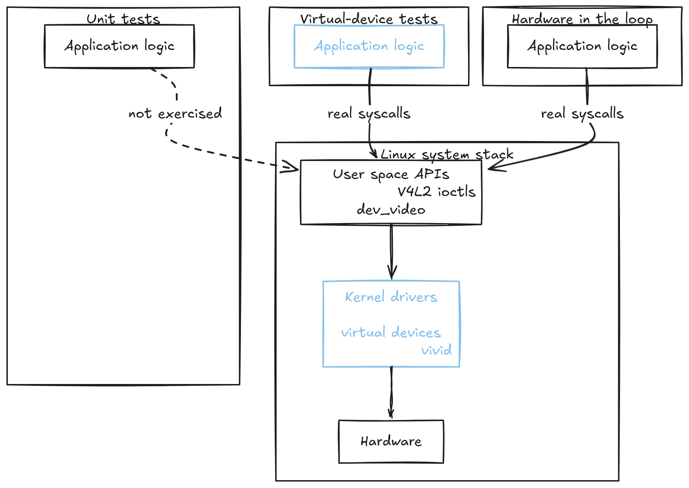
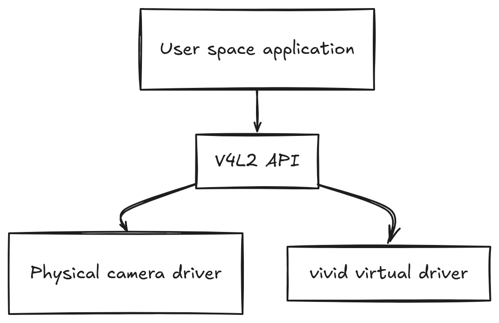

# Integration Testing for Linux Video Pipelines

!!! example
    If you just want the end result, use the repo diff as a reference: [pi-cam-capture?diff](https://github.com/astavonin/pi-cam-capture/compare/ci-and-cross...emulation-and-video-testing?diff).

    It shows the exact changes covered in this article, as they exist in the repository today, without extra commentary.


Most embedded Linux projects end up with the same testing setup. Unit tests cover parts of the logic, often in a patchy way, because syscalls and OS behavior are out of scope. Hardware-in-the-loop is used to check that the system works on the real device. Even in theory, this combination is weak and fragile, but in many teams it is still treated as "good enough". The blind spot is always the same. The boundary between user space and the kernel is rarely exercised during normal development, even though that is where a large share of real failures occur.

In Linux-based video systems, most application code does not manipulate pixels directly. It involves negotiating formats via ioctls, allocating and mapping buffers, handling blocking semantics, and interpreting metadata produced by drivers. This boundary is where failures cluster, and it is precisely the part of the system that neither unit tests nor HIL handles well.

Unit tests cannot exercise kernel behavior in any meaningful way. In the best case, they replace file descriptors, ioctls, and device state with mocks, which is fine for checking control flow and error handling. What disappears is the behavior that actually matters in video processing. Buffer queues have ordering and lifetime rules. Some ioctls return success while silently adjusting parameters. Others block depending on the driver's state. Timestamps have specific origins and invariants. These details define how a video device behaves, and a mock cannot realistically reproduce them.

And quite often the result is predictable. Code passes unit tests while embedding incorrect assumptions about alignment, stride, buffer lifetime, or sequencing. These assumptions remain invisible until the first interaction with a real device.

At that point, teams fall back to hardware-in-the-loop testing. HIL does exercise the real kernel interface, but it usually happens late and at a high cost. Access to hardware is often limited, setup can be slow, failures may be non-deterministic, and reproducing issues relies heavily on the physical context. When integration problems arise only at this stage, the iteration process can slow down significantly. Continuous Integration (CI) provides little support in this scenario. While it is sometimes possible to wire HIL into a CI pipeline, it tends to be fragile and hard to maintain reliability, which means these paths are not exercised consistently, and regressions reappear.

This creates a systemic blind spot. Unit tests validate logic in an environment that cannot fail in realistic ways. HIL validates behavior in an environment that is expensive and difficult to automate. The kernel boundary, where most integration bugs originate, remains largely untested during normal development. For Linux video systems, this is not an edge case. It is the dominant failure mode.

This gap is structural, not accidental. It comes from how different test layers interact with the system stack and which boundaries they actually cross.

{ width="640" }

The diagram shows how coverage is distributed across a Linux video, or any other typical embedded system. Unit tests remain confined to application logic and never cross into the kernel. Hardware-in-the-loop testing exercises the full stack, but it sits outside the normal development loop and is expensive to run continuously. Virtual-device integration tests occupy the middle ground. They drive real syscalls and kernel code paths through emulated drivers, allowing the user-space-to-kernel boundary to be exercised early, repeatedly, and in CI, without relying on physical hardware.

## Why Linux is unusually amenable to this kind of integration testing

Integration testing with virtual devices usually works on Linux because most hardware interaction already goes through the kernel. From the user space, the boundary is not registers or buses. It is file descriptors, ioctls, memory mappings, and kernel metadata. These boundaries are explicit, documented, and often straightforward to virtualize.

For video capture, the contract is V4L2. V4L2 allows us to discover devices via `/dev/video*` and to obtain capabilities, formats, and controls via standardized ioctls. Buffers are exchanged via MMAP or USERPTR with well-defined lifetime rules. Metadata such as timestamps and sequence numbers follow documented semantics. At the end, from the user space, a physical camera and a virtual camera look identical as long as they speak the same kernel API. In practice, this is visible directly through standard V4L2 tooling. A real camera and a virtual device appear identical at the kernel boundary.

```bash
➜ v4l2-ctl --list-devices
vivid (platform:vivid-000):
        /dev/video2

Integrated Camera: Integrated C (usb-0000:00:14.0-6):
        /dev/video0
```

Such contracts are a key difference from bare-metal or tightly coupled firmware systems. In Linux, the kernel already sits between your code and the hardware, enforcing an abstraction. That abstraction can often be backed by a real driver or a virtual one with identical user-space behavior. As long as the driver implements the same V4L2 contract, the application code exercises the same paths.

Linux also exposes enough system state to enable deterministic discovery and selection. Sysfs provides device identity, driver names, and topology under `/sys/class`. Procfs exposes the runtime context that affects behavior. Instead of guessing which `/dev/video0` is present, code and tests can identify devices by driver and capabilities, and fail explicitly when expectations are not met.

This makes Linux an incredibly practical test harness that helps to keep your codebase stable. Your integration tests are production-like in the sense that you can run real syscalls, negotiate real formats, allocate real buffers, and observe real blocking behavior without needing physical hardware attached. The kernel enforces the same rules either way.

For video systems, this matters in practice. Most integration failures are not sensor-specific. They come from incorrect assumptions about format negotiation, buffer handling, timing, or sequencing. These failures live at the kernel interface. Exercising that interface deterministically catches a large class of bugs early.

## Making the environment deterministic

Integration tests that touch kernel interfaces only make sense if the environment is predictable. If setup depends on manual steps or undocumented assumptions, failures become ambiguous and easy to dismiss. This is where many teams stop trusting integration tests altogether.

For V4L2, the environment includes user space tools, kernel support, and the way devices appear under `/dev` and `/sys`. In this project, those assumptions are encoded directly in a setup script rather than documented separately.

[The script](https://github.com/astavonin/pi-cam-capture/blob/emulation-and-video-testing/scripts/dev-setup.sh) starts by installing and verifying the required user space tooling. If inspection tools are missing, there is no point in proceeding.

```bash
for cmd in v4l2-ctl ffmpeg; do
    if command -v "$cmd" &>/dev/null; then
        success "$cmd installed"
    else
        error "$cmd not found"
        ok=false
    fi
done
```

Kernel support is checked explicitly. Virtual devices only work if the driver is available for the running kernel, and this varies by distribution.

```bash
for mod in vivid v4l2loopback; do
    if modinfo "$mod" &>/dev/null; then
        success "$mod module available"
    else
        warn "$mod module not available"
    fi
done
```

Loading the virtual camera is a deliberate step with fixed parameters. The configuration is part of the test contract, not an implementation detail.

```bash
$SUDO modprobe vivid n_devs=2 node_types=0x1,0x1 input_types=0x81,0x81
```

After loading the module, the script validates the result from user space. Tests do not assume devices exist; they require them.

```bash
$SUDO v4l2-ctl --list-devices
```

At this point, the environment is in a known state. Virtual video devices exist, they are discoverable through standard V4L2 tooling, and they expose the same kernel interfaces as physical cameras. Integration tests can rely on this without special casing or fallback logic.

The script also configures deterministic test patterns on each vivid device, using sysfs to identify them and `v4l2-ctl` to apply known formats and patterns.

```bash
if v4l2-ctl -d "$dev" --set-fmt-video=width=640,height=480,pixelformat=YUYV; then
    success "$dev: Set format to 640x480 YUYV"
fi

v4l2-ctl -d "$dev" --set-ctrl=test_pattern="$pattern"
```

This ensures that integration tests see predictable frame content, not just “some bytes”.

Finally, teardown is explicit. Kernel state is global, and CI runs must clean up after themselves.

!!! WARNING
    Kernel state is global. It is safe to run multiple integration tests in parallel on a runner that has been preconfigured with `vivid` already loaded. **CI jobs that load or unload kernel modules must not run concurrently on the same runner**.

```bash
$SUDO modprobe -r vivid
```

The result is a setup that either succeeds and is validated, or fails immediately. When an integration test fails, the failure comes from the code under test, not from an unclear or partially configured environment.

## Using kernel-provided virtual devices (`vivid`)

With a deterministic environment in place, the next question is what the integration tests should talk to. For V4L2, the choice is straightforward. Mock devices in user space do not exercise the kernel boundary. Physical cameras reintroduce cost and instability. The practical middle ground is to use a kernel driver that implements the same V4L2 contract as real hardware.

On Linux, that driver is `vivid`.

From user space, the application does not talk to hardware directly. It talks to the V4L2 API. Whether the request is handled by a physical camera driver or a virtual one is an implementation detail hidden behind the kernel interface.

{ width="640" }

This is why vivid works for integration testing. It registers `/dev/video*` nodes and implements the same ioctls, buffer APIs, and metadata semantics as real capture devices. The code under test follows the same execution paths either way.

This equivalence is visible directly through standard tooling. A physical camera and a vivid device are discovered in the same way:

```text
➜ v4l2-ctl --list-devices
vivid (platform:vivid-000):
        /dev/video2

Integrated Camera: Integrated C (usb-0000:00:14.0-6):
        /dev/video0
```

Capabilities are queried through the same ioctls and expose the same capture and streaming flags:

```text
➜ v4l2-ctl --device=/dev/video0 --all
Driver name   : uvcvideo
Capabilities  : Video Capture, Streaming
```

```text
➜ v4l2-ctl --device=/dev/video2 --all
Driver name   : vivid
Capabilities  : Video Capture, Streaming
```

Format negotiation follows the same path as well:

```text
➜ v4l2-ctl -d /dev/video2 --list-formats
[0]: 'YUYV' (YUYV 4:2:2)
```

From the application’s point of view, there is no special-case logic here. Devices are opened the same way, formats are negotiated through the same ioctls, and frames are streamed using the same buffer APIs. If the driver speaks V4L2 correctly, user space does not care whether frames originate from a sensor or from a kernel generator.

This makes vivid useful for integration testing, but also defines its limits. It does not model sensor quirks, ISP behavior, or vendor-specific timing details. Those belong in hardware-in-the-loop testing. What vivid does cover is the V4L2 surface itself: format negotiation, buffer handling, sequencing, and timing semantics. That is where many integration failures originate.
## Structuring integration tests around virtual devices

Once vivid is available, the main job is keeping integration tests honest. They should fail when the runner is not prepared, and they should not depend on accidental details like `/dev/video0` ordering.

In the repo, that logic lives in one place: a sysfs-backed discovery function plus a couple of “hard requirement” macros. The discovery code reads `/sys/class/video4linux/video*/name`, filters for devices that contain `vivid`, then verifies the device can actually be opened before returning it. That avoids probing real cameras and makes failures deterministic.

```rust
// This is a snippet but NOT a real code.
fn vivid_devices() -> Vec<u32> {
    (0..10)
        .filter(|i| {
            let name = std::fs::read_to_string(
                format!("/sys/class/video4linux/video{}/name", i)
            ).unwrap_or_default();

            name.to_lowercase().contains("vivid")
                && V4L2Device::open(*i).is_ok()
        })
        .collect()
}
```

The tests deliberately **do not skip** when vivid is missing. They panic with an actionable error, because this is the class of failures CI must catch early. The single-device macro is used for general “can open / can stream” tests.

```rust
// This is a snippet but NOT a real code.
macro_rules! require_vivid {
    () => {
        vivid_devices()
            .first()
            .copied()
            .expect("vivid device not found; run dev-setup.sh load-vivid")
    };
}
```

Some tests depend on **two devices**, because `dev-setup.sh` configures them with different patterns. That is where `require_vivid_pair!()` comes in: it asserts a pair exists and returns `(devices[0], devices[1])`. If the runner only has one vivid node, or vivid was loaded with the wrong parameters, it fails loudly.

```rust
// This is a snippet but NOT a real code.
macro_rules! require_vivid_pair {
    () => {{
        let devs = vivid_devices();
        assert!(
            devs.len() >= 2,
            "expected two vivid devices; check vivid module configuration"
        );
        (devs[0], devs[1])
    }};
}
```

From there, the test body stays intentionally boring: open device, set a known format, create a small stream, pull frames, validate invariants. The format choice is fixed (`640x480 YUYV`) so that frame sizing and pixel access are stable across runs.

```rust
let mut device = V4L2Device::open(device_index).expect("Failed to open vivid device");

let requested = Format::new(640, 480, FourCC::YUYV);
let actual = device.set_format(&requested).expect("Failed to set format");

let mut stream = device.create_stream(4).expect("Failed to create stream");
let frame = stream.next_frame().expect("Failed to capture frame");
```

One operational detail matters here: these tests are marked `#[serial]`. Kernel-backed devices are shared state. Even if the runner is “preconfigured”, concurrent open/stream/close sequences against the same nodes tend to create noise. Serializing keeps failures attributable.

```rust
#[test]
#[serial]
fn test_vivid_capture_single_frame() { /* ... */ }
```

The pattern-specific tests show why having a pair matters. The first device is expected to be configured as a gradient, the second as color bars, and the validations fail with messages that point back to the setup script.

```rust
let (gradient_device, _) = require_vivid_pair!();
// ...
let result = validate_gradient(&frame, &format);
assert!(result.is_ok(), "Gradient validation failed on first vivid device...");
```

This structure keeps the integration suite predictable: the environment requirements are explicit, discovery is deterministic, and the tests exercise the same public API surface as production code.

## Validating frame content and metadata

Streaming frames is a weak signal. A lot of broken pipelines still stream.

The typical failure is boring and expensive: format negotiation succeeds, buffers flow, sizes look right, and nothing errors out. Then someone notices the image is wrong, or timestamps jump, or sequence numbers reset under load. By that point it is usually on hardware, and it is already hard to localize.

Virtual devices help because the output is predictable. That makes it reasonable to assert properties of frames instead of just checking that data exists.

Start with metadata. Sequence numbers should increase. Timestamps should be present and ordered. If this fails, the pipeline is already violating assumptions downstream components rely on.

```rust
let frames: Vec<Frame> = (0..5)
    .map(|_| stream.next_frame().expect("capture failed"))
    .collect();

for w in frames.windows(2) {
    assert!(w[1].sequence > w[0].sequence);
    assert!(w[1].timestamp >= w[0].timestamp);
}
```

Content checks can stay minimal. vivid can generate fixed patterns. A couple of pixel samples are enough to catch the usual class of mistakes: wrong stride, wrong pixel format assumptions, or broken conversion logic.

```rust
let (r1, _, _) = frame.pixel_at(10, 10).unwrap();
let (r2, _, _) = frame.pixel_at(200, 10).unwrap();
assert!(r2 > r1);
```

This is not image quality testing. It is a sanity check that the pipeline interprets the kernel’s buffers the way it thinks it does. Once metadata and minimal content checks are in place, the integration suite stops answering “did we get a frame” and starts answering “did we handle the frame correctly”.

---

Virtual-device integration tests do not replace unit tests or hardware-in-the-loop testing. Unit tests still cover logic and edge cases. HIL still covers hardware-specific behavior. The integration layer sits in between, exercising real syscalls, ioctls, buffer queues, and timing semantics without depending on physical devices. This catches kernel-boundary failures early and pushes HIL back to what it is good at, rather than using it as the first line of integration testing.
