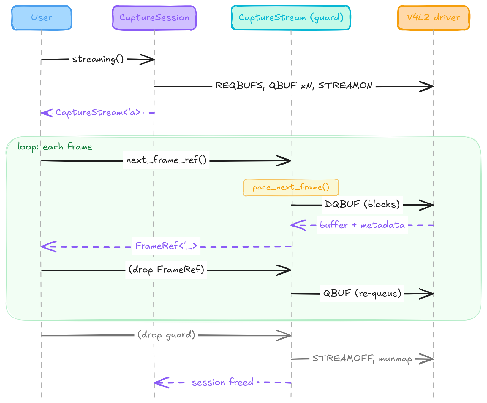
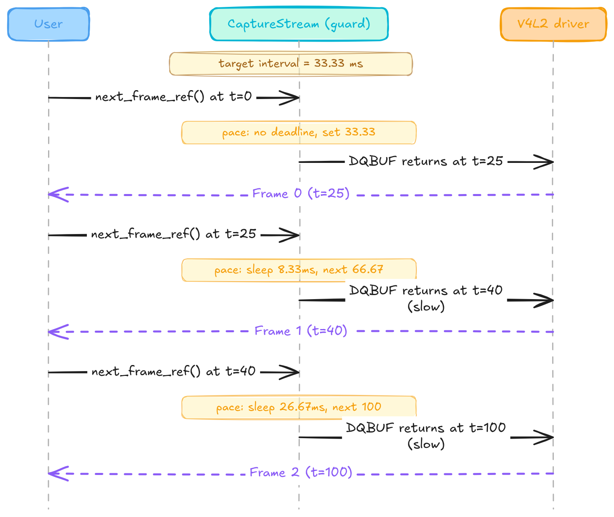

# Zero-copy capture engine: `CaptureSession` and stable FPS

A V4L2 mmap capture loop has an awkward shape for Rust. The kernel owns a ring of buffers, hands one to userland via `VIDIOC_DQBUF`, expects it back via `VIDIOC_QBUF`, and considers any pointer into that memory invalid once the buffer is re-queued. Two invariants have to hold at once: only one dequeued frame can be alive at a time, and no slice into the mmap region can outlive the streaming session. A common shortcut is to copy each frame out (`buf.to_vec()`) and hand the copy to the caller, cheap to write, expensive to run. For a 1080p YUYV stream at 30 fps that is ~124 MB/s of allocator traffic that does nothing useful.

Stage 1 of `pi-cam-capture` rewires the capture path around a lifetime-parameterised guard so that both invariants are enforced by `rustc` at compile time. The same guard also owns the FPS pacer: a two-layer design that keeps the kernel cadence honest under both mock and real hardware. This article walks through the design: the guard, the borrowed frame path, the pacer, and the 300-frame smoke test that pins the whole thing down as a CI gate.

Companion repo: [`pi-cam-capture`](https://github.com/astavonin/pi-cam-capture) at commit [`7c97f17`](https://github.com/astavonin/pi-cam-capture/commit/7c97f17).

## The allocation problem

The V4L2 mmap buffer lifecycle is textbook: `VIDIOC_REQBUFS` allocates a ring, `VIDIOC_QBUF` queues each empty buffer, `VIDIOC_STREAMON` starts capture, `VIDIOC_DQBUF` blocks until the kernel fills the next one, and `VIDIOC_QBUF` puts it back on the ring. The `v4l` crate collapses the whole state machine into `Stream::next()`, which returns `(&[u8], Metadata)`, a *borrow* into the mmap region, and re-queues the previous buffer on the next call.

The naive path is:

[`src/stream.rs:136-152`](https://github.com/astavonin/pi-cam-capture/blob/7c97f17/src/stream.rs#L136-L152)

```rust
fn next_frame(&mut self) -> Result<Frame> {
    let (buf, meta) = self
        .stream
        .next()
        .map_err(|err| StreamError::CaptureFailed(err.to_string()))?;

    let timestamp = Self::parse_timestamp(meta.timestamp.sec, meta.timestamp.usec)?;

    Ok(Frame {
        data: buf.to_vec(),
        metadata: FrameMetadata {
            sequence: meta.sequence,
            timestamp,
            bytes_used: meta.bytesused,
        },
    })
}
```

That `buf.to_vec()` is the whole cost model of the loop. At 1080p YUYV (4 147 200 bytes/frame) × 30 fps it is 124 MB/s of allocations returned to the allocator one frame later. Zero-copy here means: return the borrow, not the copy. The caller reads the mmap region directly, and the borrow is invalidated (statically) before the next `DQBUF`.

The rest of the article is about how to expose that borrow without either `unsafe` or a self-referential struct.

## The guard pattern

The prior iteration (commit [`bb09791`](https://github.com/astavonin/pi-cam-capture/commit/bb09791)) put the streaming interface directly on `CaptureSession`. Here is `start_stream`:

[`src/session.rs:124-136` @ bb09791](https://github.com/astavonin/pi-cam-capture/blob/bb09791/src/session.rs#L124-L136)

```rust
pub fn start_stream(&mut self) -> Result<()> {
    let stream = self.device.create_stream(self.config.buffer_count, self.config.fps)?;
    self.actual_fps = Some(stream.actual_fps());

    log::info!(
        "Created stream with {} buffers at {} FPS",
        self.config.buffer_count,
        stream.actual_fps()
    );

    // Drop the stream - it's already started, we'll create new ones as needed
    Ok(())
}
```

And `next_frame`, further down the same file:

[`src/session.rs:157-161` @ bb09791](https://github.com/astavonin/pi-cam-capture/blob/bb09791/src/session.rs#L157-L161)

```rust
pub fn next_frame(&mut self) -> Result<Frame> {
    // Create a temporary stream for this capture
    let mut stream = self.device.create_stream(self.config.buffer_count, self.config.fps)?;
    stream.next_frame()
}
```

Two things are wrong with this. First, `start_stream` creates a `Stream` and immediately drops it: the buffers are `REQBUFS`-allocated then torn down, so nothing actually starts. Second, `next_frame` re-runs the entire `REQBUFS → QBUF ×N → STREAMON → DQBUF → STREAMOFF` sequence per call. It is functionally correct on vivid (which is unusually tolerant), but the buffer ring is thrown away after each frame. There is no ring, there is a queue of one.

The obvious fix (store the `Stream` inside `CaptureSession`) is a self-referential struct, because `v4l::Stream<'a>` borrows from the `Device` that lives in the same struct. Rust does not let you write that without `Pin`, and even with `Pin` the API becomes hostile.

The chosen shape (commit [`62d8607`](https://github.com/astavonin/pi-cam-capture/commit/62d8607), refined in [`7c97f17`](https://github.com/astavonin/pi-cam-capture/commit/7c97f17)) is a guard:

[`src/session.rs:103-112`](https://github.com/astavonin/pi-cam-capture/blob/7c97f17/src/session.rs#L103-L112)

```rust
pub struct CaptureStream<'a, D: CameraDevice + 'a> {
    stream: D::Stream<'a>,
    actual_fps: u32,
    /// Target interval between consecutive frames for schedule-based pacing.
    target_frame_interval: Duration,
    /// Absolute deadline for the next frame call; `None` before the first call.
    /// Advances by exactly one `target_frame_interval` per call regardless of
    /// actual dequeue duration, maintaining a fixed cadence under varying load.
    next_deadline: Option<Instant>,
}
```

`CaptureStream<'a, D>` is the guard. Its lifetime `'a` is tied to a `&mut CaptureSession<D>` borrow through the constructor. (The `CaptureStream` trait from `traits.rs` is imported as `CaptureStreamTrait` in `session.rs` to avoid the name collision with this struct.)

[`src/session.rs:233-253`](https://github.com/astavonin/pi-cam-capture/blob/7c97f17/src/session.rs#L233-L253)

```rust
pub fn streaming(&mut self) -> Result<CaptureStream<'_, D>> {
    let stream = self
        .device
        .create_stream(self.config.buffer_count(), self.config.fps())?;
    let actual_fps = stream.actual_fps();

    log::info!(
        "Created stream with {} buffers at {} FPS",
        self.config.buffer_count(),
        actual_fps
    );

    self.actual_fps = Some(actual_fps);

    Ok(CaptureStream {
        stream,
        actual_fps,
        target_frame_interval: frame_interval(actual_fps),
        next_deadline: None,
    })
}
```

This is `Mutex::lock() → MutexGuard`, applied to a V4L2 stream. The `'_` on the return type is a fresh lifetime tied to `&mut self`: the guard cannot outlive the session, and while the guard exists no other `&mut CaptureSession` is possible (so no reconfiguring the format mid-stream). `REQBUFS/STREAMON` fire once when the guard is constructed; `STREAMOFF` fires when it drops. The ring persists across the entire lifetime of the guard.

The self-referential problem is dodged by *not* storing the `Stream` in `CaptureSession` at all. The session holds only the `Device`; the `Stream` lives in the guard and its `'a` binds it back to the session.

The key trait machinery is a GAT on `CameraDevice`:

[`src/traits.rs:221-244`](https://github.com/astavonin/pi-cam-capture/blob/7c97f17/src/traits.rs#L221-L244)

```rust
pub trait CameraDevice {
    /// The stream type produced by [`create_stream`](Self::create_stream).
    type Stream<'a>: CaptureStream
    where
        Self: 'a;

    /// Returns the device capabilities reported by the driver.
    fn capabilities(&self) -> &DeviceCapabilities;

    /// Queries the current capture format from the driver.
    fn format(&self) -> Result<Format>;

    /// Requests a capture format from the driver.
    ///
    /// The driver may return a different format than requested.
    /// Always use the returned `Format` for subsequent operations.
    fn set_format(&mut self, format: &Format) -> Result<Format>;

    /// Creates a capture stream, allocating `buffer_count` mmap buffers and
    /// targeting `fps` frames per second.
    ///
    /// The returned stream borrows from `self` for its lifetime.
    fn create_stream(&mut self, buffer_count: u32, fps: u32) -> Result<Self::Stream<'_>>;
}
```

`type Stream<'a>` is a lifetime-generic associated type. `V4L2Device` implements it as `V4L2Stream<'a>` (which internally borrows the `v4l::Device`); `MockDevice` implements it as `MockStream<'a>` (borrowing `&mut MockDevice` for the shared frame counter). The guard is generic over `D`, so the same `CaptureSession`/`CaptureStream` code drives both real hardware and the mock test device without a runtime branch.

### Diagram: guard lifecycle



## `BorrowedCaptureStream` and `FrameRef<'_>`

Copying every frame is the loud cost. The quiet cost is that a copy-only API forces every downstream consumer (encoder, telemetry, ML pipeline) into the same allocator-heavy pattern even when they only need a read-only view. Stage 1 introduces the borrowed alternative as an opt-in capability trait.

[`src/traits.rs:255-262`](https://github.com/astavonin/pi-cam-capture/blob/7c97f17/src/traits.rs#L255-L262)

```rust
/// Capability for streams that can return a borrowed frame view.
///
/// The returned [`FrameRef`] borrows from `self`, so callers cannot request
/// another frame while the borrowed view is still alive.
pub trait BorrowedCaptureStream {
    /// Captures the next frame as a borrowed view of stream-owned storage.
    fn next_frame_ref(&mut self) -> Result<FrameRef<'_>>;
}
```

Separate from `CaptureStream` on purpose. A future replay-from-file stream, or a stream that composites multiple sources, may not have a single stable buffer to borrow from, and forcing every implementation to provide `next_frame_ref` would be wrong. Two capabilities, opt-in.

`FrameRef` is just the borrowed twin of `Frame`:

[`src/traits.rs:170-176`](https://github.com/astavonin/pi-cam-capture/blob/7c97f17/src/traits.rs#L170-L176)

```rust
#[derive(Debug)]
pub struct FrameRef<'a> {
    /// Raw frame data borrowed from the mmap buffer.
    pub data: &'a [u8],
    /// Frame metadata.
    pub metadata: FrameMetadata,
}
```

The `V4L2Stream` impl is the direct mapping, handing the `v4l` crate's borrow through:

[`src/stream.rs:155-173`](https://github.com/astavonin/pi-cam-capture/blob/7c97f17/src/stream.rs#L155-L173)

```rust
impl BorrowedCaptureStream for V4L2Stream<'_> {
    fn next_frame_ref(&mut self) -> Result<FrameRef<'_>> {
        let (buf, meta) = self
            .stream
            .next()
            .map_err(|err| StreamError::CaptureFailed(err.to_string()))?;

        let timestamp = Self::parse_timestamp(meta.timestamp.sec, meta.timestamp.usec)?;

        Ok(FrameRef {
            data: buf,
            metadata: FrameMetadata {
                sequence: meta.sequence,
                timestamp,
                bytes_used: meta.bytesused,
            },
        })
    }
}
```

Note the lifetime elision: `&mut self` → `FrameRef<'_>`. The returned slice borrows from `self.stream` (via `v4l::Stream::next`'s signature), which in turn borrows from the mmap region owned by the `v4l::Stream`, whose lifetime is bounded by the underlying `Device`. The compiler statically prevents:

- Holding two `FrameRef`s simultaneously (each requires `&mut self` on the stream).
- Dropping the guard while a `FrameRef` is still alive (guard drop requires no outstanding borrows).
- Dropping the session while the guard is alive — the guard borrows the session's device through a `&mut` chain rooted at the `streaming()` call, so the session cannot be dropped or reborrowed while the guard is alive.

Zero unsafe, zero runtime checks, zero `Arc`.

### The conditional impl on the guard

`CaptureStream<'a, D>` is generic over `D`. It should support `next_frame_ref` when `D::Stream<'a>` implements `BorrowedCaptureStream`, and *not* when it doesn't. Rust expresses that as a conditional inherent impl:

[`src/session.rs:350-371`](https://github.com/astavonin/pi-cam-capture/blob/7c97f17/src/session.rs#L350-L371)

```rust
impl<'a, D> CaptureStream<'a, D>
where
    D: CameraDevice + 'a,
    D::Stream<'a>: BorrowedCaptureStream,
{
    /// Capture the next frame as a zero-copy borrowed view.
    ///
    /// The returned [`FrameRef`] borrows from this streaming guard, so another
    /// frame cannot be captured until the returned value is dropped.
    /// May also block to enforce the configured frame rate; see `target_frame_interval`.
    #[allow(clippy::same_name_method)]
    pub fn next_frame_ref(&mut self) -> Result<FrameRef<'_>> {
        self.pace_next_frame();
        self.stream.next_frame_ref()
    }
}
```

`next_frame_ref` is only in scope when `D::Stream<'a>: BorrowedCaptureStream`. Both `V4L2Stream` and `MockStream` satisfy it, so the method is available for production and mock code alike; a future stream that opts out simply never gets the method. There is a parallel `impl BorrowedCaptureStream for CaptureStream<'a, D>` at [`src/session.rs:388-399`](https://github.com/astavonin/pi-cam-capture/blob/7c97f17/src/session.rs#L388-L399) that satisfies the trait for generic contexts. Rust's method resolution picks the inherent method when the concrete type is known; the trait impl — which delegates to the inherent method — is needed for callers operating through a `&mut dyn BorrowedCaptureStream` or a generic `T: BorrowedCaptureStream` bound. Unit test `test_capture_stream_implements_borrowed_capture_stream_trait` in [`src/session.rs:673-689`](https://github.com/astavonin/pi-cam-capture/blob/7c97f17/src/session.rs#L673-L689) exercises exactly this path.

### The mock: scratch buffer as borrow target

The V4L2 case has an mmap region to borrow from. The mock has to conjure one:

[`src/mock.rs:107-116`](https://github.com/astavonin/pi-cam-capture/blob/7c97f17/src/mock.rs#L107-L116)

```rust
pub struct MockStream<'a> {
    device: &'a mut MockDevice,
    pattern: TestPattern,
    fps: u32,
    buffer_count: u32,
    current_frame: Vec<u8>,
    /// Injects a `CaptureFailed` error after this many successful frames. `None` means no error.
    error_after: Option<u32>,
}
```

`current_frame` is the scratch buffer. Each call overwrites it in place and returns a slice into it:

[`src/mock.rs:205-220`](https://github.com/astavonin/pi-cam-capture/blob/7c97f17/src/mock.rs#L205-L220)

```rust
impl BorrowedCaptureStream for MockStream<'_> {
    fn next_frame_ref(&mut self) -> Result<FrameRef<'_>> {
        self.check_error()?;
        let format = &self.device.format;
        write_test_frame(&mut self.current_frame, format, self.pattern);
        // Use actual buffer length so bytes_used is correct even for MJPG (where format.size == 0)
        #[allow(clippy::cast_possible_truncation)] // frame sizes fit in u32 in practice
        let bytes_used = self.current_frame.len() as u32;
        let metadata = self.next_metadata(bytes_used);

        Ok(FrameRef {
            data: &self.current_frame,
            metadata,
        })
    }
}
```

The unit test `test_mock_stream_borrowed_capture_reuses_scratch_buffer` ([`src/mock.rs:407-431`](https://github.com/astavonin/pi-cam-capture/blob/7c97f17/src/mock.rs#L407-L431)) captures two frames and asserts `first_ptr == second_ptr`, proving that the mock behaves like the real device: the scratch buffer is reused, not reallocated. This matters because the mock is the substrate for the pacer unit tests, and any hidden allocation would skew timing measurements.

<!-- TODO: verify against libcamera path (article 09). The libcamera backend does not use v4l::Stream and will need its own BorrowedCaptureStream implementation. Currently only V4L2Stream and MockStream implement the trait. -->

## FPS pacing, two layers

Zero-copy handles bandwidth. It does not handle jitter. A downstream encoder or WebRTC transport expects a metronome; a capture path that oscillates between 25 fps and 40 fps loses that even when its mean is right. Stage 1 stabilises FPS with two independent mechanisms.

### Layer 1: kernel, `VIDIOC_S_PARM` before `REQBUFS`

The first layer is the driver. `VIDIOC_S_PARM` sets `timeperframe`, the interval the driver will hold on `DQBUF` before delivering the next buffer. For vivid, this is honoured to the microsecond. For real hardware it is honoured *approximately*: sensor pixel clocks, MIPI CSI-2 packing, and ISP pipeline latencies all conspire to make the actual interval drift.

The critical detail is ordering. `REQBUFS` locks the driver into a specific streaming configuration; some drivers ignore `S_PARM` after `REQBUFS` (or reject it outright). The prior code called `Stream::with_buffers`, which fires `REQBUFS`, *before* `set_fps`. The new code inverts the order:

[`src/stream.rs:31-47`](https://github.com/astavonin/pi-cam-capture/blob/7c97f17/src/stream.rs#L31-L47)

```rust
pub fn new(device: &'a Device, buffer_count: u32, target_fps: u32) -> Result<Self> {
    // Set FPS before allocating mmap buffers; some drivers ignore S_PARM after REQBUFS.
    let actual_fps = Self::set_fps(device, target_fps)?;

    // Create the mmap stream
    let stream = Stream::with_buffers(device, Type::VideoCapture, buffer_count)
        .map_err(|err| StreamError::StartFailed(err.to_string()))?;

    // Log if the driver negotiated a different FPS
    if actual_fps == target_fps {
        log::info!("Stream configured for {actual_fps} FPS");
    } else {
        log::warn!("Requested {target_fps} FPS, but driver set {actual_fps} FPS");
    }

    Ok(Self { stream, actual_fps })
}
```

`set_fps` itself is a straightforward `G_PARM` → mutate → `S_PARM` sequence returning the driver's rounded-off actual interval ([`src/stream.rs:72-107`](https://github.com/astavonin/pi-cam-capture/blob/7c97f17/src/stream.rs#L72-L107)). The driver may round to the nearest supported rate (e.g. 30 → 25 on a PAL sensor); the returned `actual_fps` is what the userland pacer must target.

### Layer 2: userland schedule-based pacer

Layer 1 is imprecise on real hardware. A camera nominally running at 30 fps may deliver frames at 33.4 ms ± 2 ms. That is fine for the long-run mean but bad for anything that lays frames onto a fixed transmit clock. The userland layer trims this by holding a schedule and sleeping to it.

[`src/session.rs:326-338`](https://github.com/astavonin/pi-cam-capture/blob/7c97f17/src/session.rs#L326-L338)

```rust
fn pace_next_frame(&mut self) {
    let now = Instant::now();
    if let Some(deadline) = self.next_deadline {
        if now < deadline {
            std::thread::sleep(deadline - now);
        }
        // Advance deadline by one interval regardless of actual sleep duration, so the
        // pacer maintains a fixed cadence even when kernel dequeue time consumes the gap.
        self.next_deadline = Some(deadline + self.target_frame_interval);
    } else {
        self.next_deadline = Some(now + self.target_frame_interval);
    }
}
```

Two design points.

**Deadline advances by exactly one interval, always.** The alternative is to track "last frame time" and compute `next_deadline = last_frame_at + interval`. That works when calls are punctual but drifts when they are not. If the kernel takes 40 ms to hand over a "30 fps" frame, `last_frame_at + interval` puts the next deadline 33.33 ms after the *late* arrival. The pacer then does nothing (deadline already passed on entry) and the schedule slips permanently. Advancing the deadline by `+interval` from its previous value pins the schedule to wall-clock time; late arrivals catch up on the next call rather than pushing every subsequent frame back.

**No debt accumulation.** If several consecutive frames run long, `now` can pass `deadline` by more than one interval. The code does not sleep in that case; it simply skips the sleep and advances the deadline by one interval. That means brief overloads produce a short burst of tight-cadence frames followed by a return to the schedule, bounded by wall-clock, not by whatever backlog built up. The alternative (sleep until the accumulated debt is paid) can lock the loop into permanent zero-fps under transient overload; this is the classic "cascading deadline miss" failure mode.

Both callsites route through `pace_next_frame` before touching the kernel:

[`src/session.rs:315-319`](https://github.com/astavonin/pi-cam-capture/blob/7c97f17/src/session.rs#L315-L319)

```rust
#[allow(clippy::same_name_method)]
pub fn next_frame(&mut self) -> Result<Frame> {
    self.pace_next_frame();
    self.stream.next_frame()
}
```

On the vivid virtual device Layer 2 rarely fires: the kernel is already delivering frames at exactly 33.33 ms and `deadline - now` is small or negative. On a real IMX477 or IMX708, Layer 2 is expected to become the trim: whenever the sensor delivers early, the pacer absorbs the difference; when it delivers late, the pacer yields immediately and the next frame's deadline is offset from the ideal schedule, not from the late arrival.

Neither layer alone is sufficient. Layer 1 alone is what real cameras give you: an approximate cadence with sensor-driven jitter. Layer 2 alone (with `S_PARM` unset) would race against a driver delivering as fast as it can, and the sleep floor would compete with `DQBUF`'s blocking; on any frame where the kernel already held for the interval, the pacer would sleep on top of that hold and overshoot.

### Diagram: pacer with a slow producer



Deadlines land on `33.33`, `66.67`, `100.00` regardless of individual dequeue durations. A tardy frame at t=40 does not push the next deadline to t=73.33: it stays at t=66.67, and the pacer sleeps a shorter interval to recover.

<!-- TODO: real Pi 5 measurements to compare Layer 1-only vs Layer 1+2 jitter. Not possible until article 09 (libcamera path) makes V4L2 capture from IMX477/IMX708 work. -->

## The 300-frame smoke test

The article's payoff is a repeatable CI gate. Without one, "stable FPS" is an assertion; with one it is a fact anyone can reproduce on vivid.

[`tests/vivid_integration.rs:233-304`](https://github.com/astavonin/pi-cam-capture/blob/7c97f17/tests/vivid_integration.rs#L233-L304)

```rust
#[test]
#[serial]
fn test_vivid_fps_stability() {
    const FRAME_COUNT: usize = 300;
    const MIN_MEAN_MS: f64 = 31.67;
    const MAX_MEAN_MS: f64 = 35.00;
    const MAX_STD_DEV_MS: f64 = 3.0;

    let device_index = require_vivid!();
    let config = CaptureConfig::builder()
        .device(device_index)
        .resolution(640, 480)
        .format(FourCC::YUYV)
        .fps(30)
        .buffer_count(4)
        .build()
        .expect("vivid capture config should be valid");

    let mut session = CaptureSession::new(config).expect("Failed to create vivid session");
    let mut stream = session.streaming().expect("Failed to create vivid stream");
    let mut call_starts = Vec::with_capacity(FRAME_COUNT);

    for _ in 0..FRAME_COUNT {
        call_starts.push(Instant::now());
        let frame = stream
            .next_frame_ref()
            .expect("Failed to capture borrowed frame");
        assert!(
            frame.metadata.bytes_used > 0,
            "Bytes used should be positive"
        );
    }
    // ... interval math + assertions
}
```

The shape matters as much as the numbers.

**Timestamps are taken before `next_frame_ref`, not after.** The measured interval is the interval between call *entries*, the period from the caller's point of view. That is the metric a downstream encoder actually cares about (when does the next frame arrive at my input?), not the period from `DQBUF` return to the next `DQBUF` return.

**`FrameRef` drops at the end of the loop body.** The `frame` binding goes out of scope before the next iteration writes to `call_starts`, so the borrow does not conflict with the `Vec<Instant>`. This is the exact invariant the trait design promises: only one `FrameRef` alive at a time, and the compiler enforces it in the test body just as in production code.

**Thresholds.** Mean ∈ [31.67, 35.00] ms is ±5% around the ideal 33.33 ms, the tolerance that any real 30 fps consumer allows. σ < 3 ms bounds the *jitter*. Both must hold: a stream that runs at 32 ms mean but oscillates between 20 and 44 ms has the right average and is still useless.

The assertions include `actual_fps`, `min`, `max`, and `σ` in their failure messages so a CI failure gives everything needed to triage without a rerun.

[`tests/vivid_integration.rs:294-303`](https://github.com/astavonin/pi-cam-capture/blob/7c97f17/tests/vivid_integration.rs#L294-L303)

```rust
    assert!(
        (MIN_MEAN_MS..=MAX_MEAN_MS).contains(&mean_ms),
        "Mean {mean_ms:.2} ms outside [{MIN_MEAN_MS:.2}, {MAX_MEAN_MS:.2}] ms \
         (actual_fps={actual_fps}, min={min_ms:.2}ms, max={max_ms:.2}ms, σ={std_dev_ms:.2}ms)"
    );
    assert!(
        std_dev_ms < MAX_STD_DEV_MS,
        "σ {std_dev_ms:.2} ms >= {MAX_STD_DEV_MS:.2} ms \
         (actual_fps={actual_fps}, mean={mean_ms:.2}ms, min={min_ms:.2}ms, max={max_ms:.2}ms)"
    );
```

The test is gated on the `integration` feature (`#![cfg(feature = "integration")]` at the top of the file) and on vivid being loaded. The `require_vivid!` macro panics with the exact command to load vivid: fail-loud, not fail-silent. This is the article-02 rule enforced at test level: any environment that cannot capture is a broken environment, not a skipped one.

The vivid setup (loading the module and configuring webcam-style inputs) is covered in [Integration Testing for Linux Video Pipelines](https://gtog.dev/part01/02-emulation-and-video-testing/).

## Design decisions and trade-offs

**Why a guard, not a self-referential struct.** The self-referential shape is expressible with `Pin` + `unsafe`, but every downstream API becomes awkward and the crate's `unsafe_code = "forbid"` lint has to be relaxed. The guard shape puts the same borrow relationship in the type system, with `CaptureStream<'a, D>` where `'a` binds back to the session, and stays entirely in safe Rust.

**Why a separate `BorrowedCaptureStream` trait.** Zero-copy is not a universal capability. A stream that composites multiple sources, or one backed by network-received compressed frames, may not have a stable buffer to borrow from. Splitting the trait keeps `CaptureStream` viable for streams that cannot borrow, while `next_frame_ref` is available on any guard whose inner stream opts in.

**Why schedule-based pacing over interval-since-last.** Interval-since-last drifts because the reference point moves with the frame arrivals. If the kernel takes 40 ms to hand over a "30 fps" frame, `last_frame_at + interval` puts the next deadline 33.33 ms after that late arrival, so the schedule slips permanently. Schedule-based pacing pins the reference to wall-clock: the deadline advances by exactly one interval from its previous value, so late arrivals catch up on the next call instead of dragging the whole schedule with them.

**Why the pacer lives in the guard, not the stream.** The pacer needs to fire on both `next_frame` and `next_frame_ref` uniformly. Putting it in the stream would either force every implementation to duplicate the sleep logic (`V4L2Stream`, `MockStream`, and any future stream) or force it into a shared helper that the trait would have to expose. Putting it in the guard makes it a single implementation applied uniformly, and it composes naturally with the guard's lifetime.

**Why fail-loud on missing vivid.** Silently skipping the test would turn a broken CI environment into a green build. The `require_vivid!` macro panics; missing vivid is treated as a test failure, and the panic message includes the exact remediation command.

## What's next

The guard now runs at a stable cadence and the borrow checker keeps the buffer protocol honest. Two threads open up from here.

The first is format: the tests all run at YUYV 640×480 because that is what vivid gives you. Real cameras negotiate. Sensor-native formats (SRGGB10 on the IMX477, SBGGR10 on the IMX708), stride quirks, driver-preferred resolutions. Article 04 walks through format negotiation, the `VIDIOC_ENUM_FMT` / `VIDIOC_TRY_FMT` / `VIDIOC_S_FMT` dance, and how the `Format` type's stride and size fields interact with driver rounding.

The second is control. Zero-copy and stable FPS are the transport layer of the capture path; exposure, gain, white balance, and (on the IMX708) autofocus are the *content* layer. Article 05 covers V4L2 controls via the `v4l::Control` interface, the difference between camera-specific and standard controls, and how per-frame control changes interact with the buffer ring you now understand.

