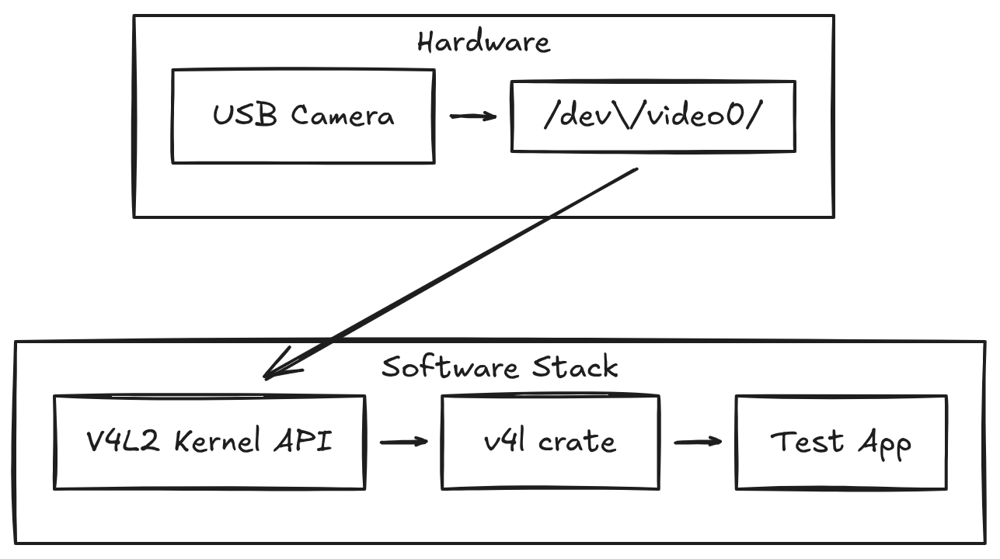

# Cross-Compiling Rust for Raspberry Pi

!!! example
    If you're not interested in the reasoning behind the solution but just want a reference, there is a [small repository for you](https://github.com/astavonin/pi-cam-capture/tree/ci-and-cross). It includes the capture loop, cross-compilation setup, CI pipeline, and all supporting configurations, presented exactly as they are today.

    It’s the straightforward, no-commentary version of this article.

The goal of this project is straightforward: build a glass-to-glass video pipeline using a Raspberry Pi as a physical device for demo purposes. This article covers the first step, building the foundation that everything else will depend on. At this stage, a USB `V4L2` camera is enough. It allows exercising the capture path and, more importantly, the build and CI setup, which should be a first step for any long-term project, even a demo one.

The capture code here is deliberately boring. It opens `/dev/video0`, asks for YUYV at 1280×720, sets up MMAP buffers, and loops over frames. None of that is the hard part. Things get interesting only when the `v4l` crate pulls in `bindgen`, and the build has to work for aarch64 as reliably as it does on x86. From that point on, the problem stops being about video and turns into a question of tooling, CI behavior, and how reproducible the environment really is.

When evaluating language options for this project, Go naturally comes up early. Its cross-compilation workflow is hard to ignore: producing an ARM binary is usually a one-line operation. That makes it an attractive choice for small utilities and early prototypes, especially when the goal is to move quickly.

```
GOOS=linux GOARCH=arm64 go build
```

That simplicity has its price. Garbage collection introduces uncertainty that is difficult to justify in a timing-sensitive video capture loop. C++ avoids that problem, but cross-compiling it for embedded targets often shifts the focus away from the code and onto toolchains, sysroots, and environment quirks. Rust ends up as a more practical compromise. Its build system is less streamlined than Go’s, but it avoids GC pauses and sidesteps much of the operational complexity typical of C++ cross-toolchains. For a Raspberry Pi video-capture codebase, that balance is usually acceptable.

So, the plan is to develop on fast `x86` hardware, reliably ship aarch64 binaries, and avoid relying on the Pi itself for builds.


## Test App: V4L Camera Capture

To start, it makes sense to use something as small as possible while still reflecting real conditions. A minimal Rust application that reads frames from a USB V4L2 camera is enough for that. The intention at this stage is not to build a full pipeline, but to establish a stable baseline for CI and cross-compilation. A simple capture loop is sufficient to surface most toolchain issues early, long before higher-level pipeline logic enters the picture.

This keeps the focus where it belongs in the initial phase: not on feature completeness, but on whether the build environment, dependencies, and target architecture behave consistently under cross-compilation.

{ width="640" }

```rust
let dev = v4l::Device::new(0)?;

let mut fmt = dev.format()?;
fmt.width = 1280;
fmt.height = 720;
fmt.fourcc = v4l::FourCC::new(b"YUYV");

let _ = dev.set_format(&fmt)?;
let mut stream =
    v4l::io::mmap::Stream::with_buffers(&dev, v4l::buffer::Type::VideoCapture, 4)?;
while let Ok((buf, meta)) = stream.next() {
    println!("size={} seq={} ts={}", buf.len(), meta.sequence, meta.timestamp);
}
```

As expected, even this minimal example does not cross-compile cleanly out of the box. The combination of the v4l crate, its reliance on bindgen, and the requirement for a compatible libclang version is enough to expose problems in the build environment. This is precisely the kind of friction that needs to be addressed early, before the codebase grows beyond a simple capture loop.

## **Why Not Just gcc-aarch64-linux-gnu?**

You can easily wire the toolchain manually. It usually starts like this:

```bash
sudo apt install gcc-aarch64-linux-gnu
rustup target add aarch64-unknown-linux-gnu
```

Then you point Cargo at the cross-linker:

```toml
# .cargo/config.toml

[target.aarch64-unknown-linux-gnu]
linker = "aarch64-linux-gnu-gcc"
```

At this point, you can:

```

cargo build --target aarch64-unknown-linux-gnu

```

This setup may work at a given point in time, but it is fragile. The linker alone is not enough; `bindgen` also depends on a compatible `libclang`, along with the correct headers and sysroot. Any mismatch between these components is enough to break the build, usually resulting in a cascade of `libclang` errors. This kind of brittleness is the main reason to move toward a dedicated, containerized cross-compilation image instead of relying on ad-hoc host configuration.

By contrast, moving the entire toolchain into a dedicated cross-compilation image turns it into a versioned artifact. The linker, sysroot, `libclang`, and all supporting packages are bundled into a single Docker image that can be rebuilt, tagged, and reused. From the project’s perspective, the only requirement is a `Cross.toml` file pointing at a specific image, such as `ghcr.io/astavonin/cross-aarch64:llvm12`. Both local builds and CI then run against the exact same environment. This approach avoids the fragility of host-level configuration and is the main reason a containerized setup is preferred over a manually assembled `gcc-aarch64-linux-gnu` toolchain.


## Building a Custom cross Image

The natural question is, why not just use the stock `ghcr.io/cross-rs/aarch64-unknown-linux-gnu` image? It works for many projects, and for simple crates, it’s perfectly fine. The problem shows up the moment the build pulls in `v4l`, because that drags in `bindgen`, and `bindgen` depends on `libclang`. The default cross image ships an older `libclang` that doesn’t play well with some of the functions `bindgen` expects. That’s how you end up with the familiar error:

```
A libclang function was called that is not supported
called function = clang_getTranslationUnitTargetInfo
```

I started from the official cross-rs base:

```docker
FROM ghcr.io/cross-rs/aarch64-unknown-linux-gnu:latest
```

This image is based on **Ubuntu 16.04 Xenial**, which becomes a critical part in components selection. Xenial is old, and the available LLVM packages for it are limited. If you look at: [https://apt.llvm.org/xenial/dists/](https://apt.llvm.org/xenial/dists/), the highest LLVM/Clang version published for Xenial is **12**. That’s the ceiling. Anything newer doesn’t exist for this base distribution; we can use PPA if needed, but 12 is enough for my case.

So the choice of Clang wasn’t aesthetic — the platform dictated it. LLVM 12 is the newest supported toolchain you can install inside Xenial without rebuilding LLVM from source, and it’s new enough to keep `bindgen` happy for `v4l`.

The [Dockerfile](https://github.com/astavonin/cross-aarch64/blob/master/Dockerfile) installs the LLVM 12 family and exposes it to bindgen:

```docker
ENV LIBCLANG_PATH=/usr/lib/llvm-12/lib
ENV CLANG_PATH=/usr/bin/clang-12
ENV LLVM_CONFIG_PATH=/usr/bin/llvm-config-12
```

## Configuring Rust Projects with `Cross.toml`

Once the custom image is available, integrating it into a Rust project is straightforward. All configuration is contained in a small `Cross.toml` file at the root of the repository. This file specifies which Docker image should be used for `aarch64` builds, ensuring that both local builds and CI run against the same toolchain and environment.

A minimal configuration looks like this:

```ini
[target.aarch64-unknown-linux-gnu]
image = "ghcr.io/astavonin/cross-aarch64:llvm12"

[build.env]
passthrough = ["RUST_BACKTRACE"]
```

That’s all you need. Now the actual build becomes:

```bash
cross build --release --target aarch64-unknown-linux-gnu
```

And under the hood, cross will:

1. Pull or reuse your custom image with the correct `libclang`.
2. Mount the Rust project inside the container.
3. Invoke `cargo build` using the aarch64 toolchain baked into the image.

The important part here is that the toolchain is no longer spread across multiple machines or CI runners. Everything that matters — linker, sysroot, libclang, headers — travels together inside a versioned container.

## CI Strategy: Fast x86 Builds + On-Demand ARM Artifacts

CI resources are limited, so build time needs to be used carefully. Running native x86 builds on GitHub Actions provides fast feedback from unit and integration tests without paying the overhead of container startup or invoking the aarch64 toolchain. For feature branches and routine development, this level of validation is sufficient and keeps the feedback loop short.

{ width="640" }

Cross-compiling for ARM adds real overhead: container startup, toolchain initialization, and `bindgen` running against the correct `libclang`. This is reasonable when an ARM artifact is actually needed, but it is unnecessary work for every feature branch. A common compromise is to run fast native x86 builds on branches, and run aarch64 cross-builds only on `main`, where release artifacts are produced. This keeps CI feedback fast while still guaranteeing that the deployable binary is built in a reproducible ARM environment.

This split keeps the feedback loop short while still producing reliable ARM binaries when they matter. It also avoids any dependency on native ARM runners, which are typically slower or require additional infrastructure. All builds run on standard x86 GitHub runners, with the custom cross image ensuring that ARM artifacts are produced in a consistent and reproducible environment.

---

With the toolchain in place and the CI behaving predictably, it's time to move on to the parts of the project that actually matter. The tiny capture app still lacks many functionalities. Next comes testing with the native Pi camera modules, measuring queue depth, watching how the system behaves under thermal load, and shaping the first real version of the video pipeline.

